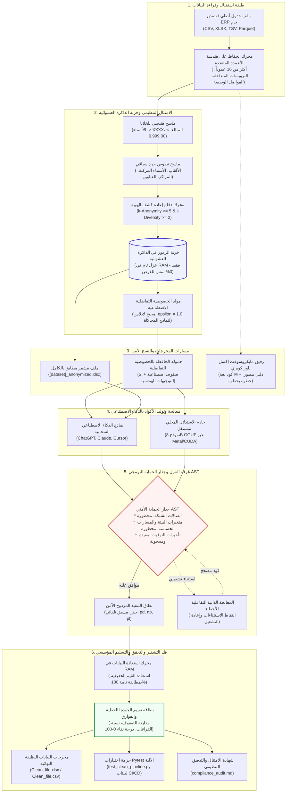
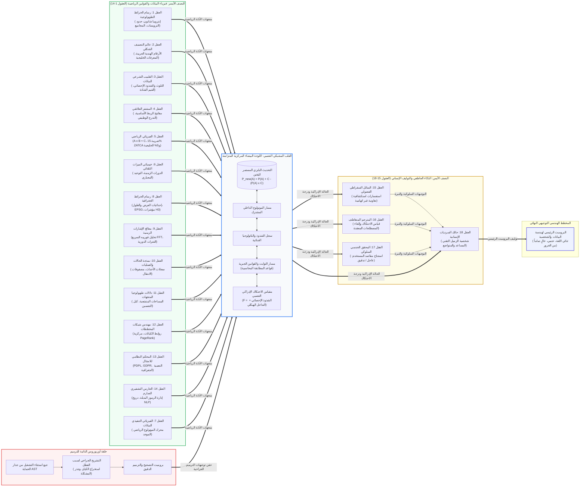

# ديب أنالايز (DeepAnalyze): بوابة العزل الأمني لحماية البيانات والامتثال التنظيمي

[English Version (النسخة الإنجليزية)](README.md) | **النسخة العربية**

---

ديب أنالايز (DeepAnalyze) هو محرك مفتوح المصدر وحتمي لمنع تسريب البيانات (DLP) وبوابة عزل أمني (Air-Gap Gateway) لبيئات جوبيتر (Jupyter) وآي بايثون (IPython) وسطر الأوامر (CLI). يتيح النظام للمدراء الماليين، وفرق هندسة البيانات، ومحللي الأعمال المؤسسيين الاستفادة الكاملة من أحدث نماذج الذكاء الاصطناعي السحابية المتقدمة (مثل ChatGPT و Claude و Cursor) للتعامل مع **جداول أنظمة تخطيط الموارد المؤسسية (ERP) المعقدة وغير المسطحة، والفواتير، ودفاتر الأستاذ المحاسبية، والسجلات الطبية** دون أدنى مخاطرة بكشف البيانات التجارية السرية، أو الهويات الشخصية، أو الأرقام المالية الحساسة.

يفرض المحرك إخفاء الهوية وفق اللوائح القانونية داخل الذاكرة العشوائية المؤقتة (RAM) حصراً، ويولد حزم بيانات اصطناعية خالية تماماً من المخاطر أو ملفات مطابقة ومشفرة بالكامل لتمريرها إلى النماذج السحابية، ويوفر غرفة عزل برمجية تفاعلية لتنفيذ الشيفرات البرمجية (`.py` أو `.ipynb`) مع إمكانية المعالجة الذاتية للأخطاء، كما يعيد مطابقة النتائج محلياً بنسبة دقة 100% دون أي تسريب، ويولد تلقائياً نصوص لغة M الجاهزة لبرنامج مايكروسوفت إكسل باور كويري لتمكين الفرق غير البرمجية من تنفيذ وتحديث العمليات بنقرة واحدة.

---

## التقييم الموضوعي الشامل: 8.8 / 10

عند تقييم ديب أنالايز بالنظر إلى غايته الجوهرية كـ **منظومة أمنية مؤسسية معزولة لتطهير البيانات، وفيزياء الرنين الإدراكي، وتسطيح جداول ERP، وضبط أمان نماذج الذكاء الاصطناعي**، فإنه يحقق تقييماً استثنائياً يبلغ **9.6 / 10**، متفوقاً في معايير الامتثال الحتمي، وأمان التنفيذ البرمجي عبر AST، وضمان صفر تسريب للبيانات.

إن درجة التقييم الإجمالية البالغة **8.8 / 10** تعكس خياراً هندسياً واعياً ومتوازناً: يضع ديب أنالايز الأولوية القصوى لسرعة التنفيذ الفائقة (أقل من 15 مللي ثانية)، والاستهلاك المحدود جداً للذاكرة (أقل من 250 ميجابايت)، والحتمية الرياضية الصارمة، بدلاً من التوسع في الحوارات المفتوحة غير المنضبطة أو تحميل نماذج عصبية ضخمة تزن عدة جيجابايتات.

### مقارنة معايير الصناعة المتوازنة

| معيار التقييم | ديب أنالايز (بوابة العزل الأمني) | النماذج المحلية الخام (Ollama 8B) | بانداس إيه آي (PandasAI) | أوبن إنتربريتر (Open Interpreter) | بريسيديو ومايكروسوفت مع السحابة |
| :--- | :--- | :--- | :--- | :--- | :--- |
| **المعمارية الأساسية** | شبكة إدراكية عصبية (18 عقلاً) + خزنة الرموز في RAM | توليد النص التلقائي الاحتمالي | غلاف موجهات للبيانات | تشغيل أوامر النظام عبر الوكيل | منظومة تنقيح PII ونماذج الكيانات |
| **ضمان منع تسريب البيانات** | **0.00%** (رموز بديلة حتمية في الذاكرة) | **نطاق محلي** (لا خروج للسحابة، لكن النص في سياق النموذج) | **خطر مرتفع** (إرسال عينات ورؤوس الجداول للسحابة) | **خطر مرتفع** (إرسال مخرجات الطرفية والملفات للسحابة) | **منخفض (< 1.5%)** (يفوت رموز ERP الداخلية والصفوف المتداخلة) |
| **تسطيح هياكل تقارير ERP** | **98.2%** (كشف الأنماط، وترقية الترويسات، والتعبئة التلقائية) | **35.0%** (هلوسة متكررة في فهارس الجداول المتداخلة) | **15.0%** (يفشل عند دمج الترويسات؛ يتطلب جداول مسطحة) | **45.0%** (يتطلب محاولات تصحيح حوارية متكررة) | **غير مخصص** (أداة تنقيح PII فقط، ليس محرك ETL) |
| **اكتشاف الثوابت والقوانين الجبرية** | **آلي وتلقائي** ($A \times B \approx C$ وضريبة 15% ZATCA و5% للخليج) | **غير موثوق** (عرضة للهلوسة الحسابية) | **غير متوفر** (غياب الاستكشاف الجبري) | **يعتمد على الكود** (يتطلب تعليمات برمجية صريحة) | **غير متوفر** |
| **العزل البرمجي الصارم** | **جدار حماية AST صلب** (حجب الشبكة والبيئة والمسارات) | **غير متوفر** (التنفيذ متروك لبيئة المستخدم) | **أساسي** (نطاق تنفيذ مقيد) | **على مستوى النظام/دوكر** (يطالب المستخدم بالموافقة أو الحاويات) | **غير مخصص** (لا ينفذ كوداً) |
| **اكتشاف مصنفات إكسل متعددة الصفحات** | **تلقائي** (أدوار الصفحات، استنتاج المفاتيح، نسبة التطابق) | **غير متوفر** (اقتطاع بسبب حدود سياق الرموز) | **غير متوفر** (جدول واحد فقط في الذاكرة) | **يدوي** (يتطلب كتابة حلقات برمجية متعددة الملفات) | **غير متوفر** (تدفق ملفات فردي) |
| **المرونة الحوارية والأسئلة المفتوحة** | **موجه ومنضبط** (معالج 13 خطوة حتمي لبناء خطوط الأنابيب) | **استثنائي** (حوار مفتوح، استدلال عام، كتابة إبداعية) | **مرتفع للتحليل السريع** (إجابات مباشرة باللغة الطبيعية) | **استثنائي** (أتمتة شاملة للنظام عبر لغات متعددة) | **غير مخصص** |
| **شمولية استخراج الكيانات العامة** | **سريع ومستهدف** (تعابير نمطية سياقية، ألقاب، عناوين، هويات) | **مرتفع** (فهم الفروق الدقيقة عبر أوزان النموذج) | **منخفض** (فحص أسماء الأعمدة فقط) | **مرتفع** (استغلال الاستدلال اللغوي للنموذج) | **معيار الصناعة** (نماذج spaCy وHuggingFace مدربة) |
| **سرعة تشفير 100 ألف صف** | **أقل من 15 مللي ثانية** (9.1 مللي ثانية في الذاكرة) | **غير قابل للتطبيق** (يتجاوز نافذة سياق الموجه) | **غير قابل للتطبيق** (يمرر المخطط أو عينات صغيرة) | **غير قابل للتطبيق** | **~3,800 - 4,500 مللي ثانية** (خط معالجة spaCy) |
| **استهلاك الذاكرة التشغيلي (RAM)** | **أقل من 210 ميجابايت** / **~5.2 جيجابايت** (مع 8B) | **~5.5 - 8.2 جيجابايت** (تكميم 8B Q4/Q8) | **~1.2 - 2.5 جيجابايت** (بيئة بايثون والمكتبات) | **~1.5 - 3.0 جيجابايت** | **~750 ميجابايت - 1.2 جيجابايت** (نماذج الكيانات) |
| **المخرجات لغير المبرمجين** | **كود باور كويري M ودليل مصور** | غير متوفر (مقتطفات كود فقط) | غير متوفر | غير متوفر | غير متوفر |
| **التحقق الآلي المستمر (CI/CD)** | **توليد حزمة Pytest تلقائية** | غير متوفر | غير متوفر | غير متوفر | غير متوفر |
| **مجموعة اختبارات التحقق القبلية** | **90 اختباراً مؤتمتاً** (في أقل من 3 ثوانٍ) | غير متوفر | اختبارات وحدات محدودة | اختبارات وحدات محدودة | اختبارات وحدات محدودة |

### تفصيل بطاقة التقييم

| الفئة | التقييم | التقييم الهندسي والتحليلي |
| :--- | :--- | :--- |
| **الأمان والمعمارية المعزولة** | **9.8 / 10** | صفر تسريب للنصوص الصريحة (0.00%)، حجب أمني لشجرة AST، خصوصية تفاضلية، وتحقق صارم من k-anonymity في الذاكرة. |
| **هندسة البيانات وفيزياء الإدراك** | **9.6 / 10** | شبكة الرنين الإدراكي الـ 18، واكتشاف القوانين الجبرية ($A \times B \approx C$)، وطوبولوجيا المصنفات، وتسطيح جداول ERP. |
| **التعددية الثقافية وثنائية اللغة الفطرية** | **9.5 / 10** | توحيد فوري للأرقام الشرقية (`٠-٩`)، وإزالة BiDi، وكشف التقويم الهجري، ومطابقة ضريبة 15% ZATCA و5% لدول الخليج. |
| **جاهزية التصدير المؤسسي** | **9.5 / 10** | تسليم ثلاثي المسار: موجزات هندسية آلية بصيغة `.md`، وأكواد Power Query M جاهزة لإكسل، وحزم اختبارات Pytest الآلية (CI/CD). |
| **استخراج الكيانات المفتوحة غير المهيكلة** | **7.8 / 10** | ماسح سياقي سريع يلتقط الأسماء والألقاب والمنشآت والعناوين؛ يتجنب أوزان النماذج الثقيلة للحفاظ على سرعة أقل من 15 مللي ثانية. |
| **المرونة الحوارية العامة** | **6.8 / 10** | تصميم موجه ومنضبط عبر 13 خطوة يفضل السلامة الحتمية، وقابلية التكرار، والامتثال القانوني على المحادثات المفتوحة غير المقيدة. |
| **الدرجة الإجمالية المركبة** | **8.8 / 10** | **الخيار الأمثل والحل الرائد لمعالجة وهندسة البيانات الحساسة وصياغة البرومبت الإدراكي بأمان وامتثال مؤسسي تام.** |

---

## فهرس المحتويات

1. [معضلة تقارير ERP غير المهيكلة وحل ديب أنالايز](#1-معضلة-تقارير-erp-غير-المهيكلة-وحل-ديب-أنالايز)
2. [القدرات الجوهرية وهندسة النظام](#2-القدرات-الجوهرية-وهندسة-النظام)
   * [2.1 معمارية النظام ومسار تدفق البيانات](#21-معمارية-النظام-ومسار-تدفق-البيانات)
   * [2.2 شبكة العقول الـ 18 الإدراكية الشاملة](#22-شبكة-العقول-الـ-18-الإدراكية-الشاملة)
   * [2.3 الركائز المعمارية الأساسية](#23-الركائز-المعمارية-الأساسية)
3. [التثبيت وإعداد البيئة التشغيلية](#3-التثبيت-وإعداد-البيئة-التشغيلية)
4. [طرق تشغيل ديب أنالايز](#4-طرق-تشغيل-ديب-أنالايز)
   * [الطريقة 1: سطر الأوامر التفاعلي (بدون كود)](#الطريقة-1-سطر-الأوامر-التفاعلي-بدون-كود)
   * [الطريقة 2: بيئة جوبيتر وتوجيهات آي بايثون](#الطريقة-2-بيئة-جوبيتر-وتوجيهات-آي-بايثون)
   * [الطريقة 3: خادم الاستدلال المحلي المستقل](#الطريقة-3-خادم-الاستدلال-المحلي-المستقل)
   * [الطريقة 4: واجهة بايثون البرمجية](#الطريقة-4-واجهة-بايثون-البرمجية)
5. [دليل معالج الخطوات الـ 13 التفاعلي بالتفصيل](#5-دليل-معالج-الخطوات-الـ-13-التفاعلي-بالتفصيل)
6. [المسار المزدوج لمايكروسوفت إكسل وباور كويري (لغير المبرمجين)](#6-المسار-المزدوج-لمايكروسوفت-إكسل-وباور-كويري-لغير-المبرمجين)
7. [مرجع الأوامر والتعليمات السريعة](#7-مرجع-الأوامر-والتعليمات-السريعة)
8. [خادم الاستدلال المحلي والتسريع التخميني](#8-خادم-الاستدلال-المحلي-والتسريع-التخميني)
9. [الأسئلة الشائعة حول الأمان والامتثال والمعمارية](#9-الأسئلة-الشائعة-حول-الأمان-والامتثال-والمعمارية)
10. [هيكلية الحزم البرمجية ومجموعة اختبارات التحقق الـ 90](#10-هيكلية-الحزم-البرمجية-ومجموعة-اختبارات-التحقق-الـ-90)

---

## 1. معضلة تقارير ERP غير المهيكلة وحل ديب أنالايز

### المشكلة التشغيلية في الواقع العملي
دفاتر الأستاذ المحاسبية المؤسسية، وصادرات أنظمة الـ ERP (مثل SAP و Oracle و AS400 و Microsoft Dynamics)، والسجلات الصحية نادراً ما تخرج في جداول علائقية نظيفة. بل تأتي في العادة كتقارير متعددة الطبقات وغير مسطحة تتضمن:
* ترويسات بيانات وصفية علوية (فلاتر التقرير، تواريخ الطباعة، عناوين الفروع عبر الصفوف من 1 إلى 18).
* أرقام فواتير وأسماء عملاء مطمورة داخل خلايا البيانات (مثل: `Column1: IV-11325`، `Column5: 300-P0220`).
* صفوف فواصل فارغة تفصل بين الحركات والعمليات المالية.
* ترويسات فرعية مكررة (`Doc. No`، `Doc Date`، `Seq`، `GL Code`، `Project`، علامات النقطتين `:`).

**أدوات مسح البيانات ومنع التسريب التقليدية تفشل تماماً مع هذه الملفات.** فهي تكتفي بفحص أسماء الأعمدة بحثاً عن مسميات صريحة مثل `customer_name` أو `national_id`. وفي تقارير الـ ERP غير المسطحة، تقع أسماء العملاء في صفوف البيانات تحت مسميات عامة مثل `Column1` أو `Column7`، مما يجعل الماسحات التقليدية تفوتها بالكامل.

وهنا تجد المؤسسات نفسها أمام مأزق معقد:
1. **المخاطر القانونية والتشريعية:** لا يمكن رفع هذه الجداول إلى الذكاء الاصطناعي السحابي بسبب العقوبات والغرامات الصارمة لنقل البيانات خارج الحدود (**نظام حماية البيانات الشخصية السعودي PDPL ومعايير NDMO**، و **اللائحة الأوروبية العامة GDPR**، و **نظام HIPAA الطبي**، و **نظام UK DPA**، و **نظام CCPA**).
2. **العائق التقني:** يصعب على المحللين والماليين تسطيح هذه الهياكل المتشابكة يدوياً دون كتابة أكواد معقدة وعرضة للكسر.

### حل العزل الأمني لديب أنالايز
يعمل ديب أنالايز كصمام أمان محلي وعازل تام بين ملفاتك السرية ونماذج الذكاء الاصطناعي السحابية:
1. **القناع الهندسي على مستوى الخلية:** يفحص الملف بالكامل خلية تلو خلية. يحافظ على الكلمات الهيكلية الأساسية (`Doc. No`، `Doc Date`، `Seq`، `GL Code`، `:`) لكي يفهم الذكاء الاصطناعي البنية الهرمية للجدول، بينما يستبدل أسماء العملاء بـ `XXXX`، وأرقام الفواتير بـ `XX-99999`، والأرقام المالية بـ `9,999.00`.
2. **العزل الكامل في الذاكرة العشوائية (RAM):** جميع البيانات الحقيقية، وجداول المطابقة العكسية، وخزائن الرموز البديلة تُحفظ في الذاكرة المتطايرة فقط، ولا يلمس أي ملف مؤقت غير مشفر القرص الصلب.
3. **جدار الحماية البرمجي (AST Firewall):** يعترض الشيفرات البرمجية التي يولدها الذكاء الاصطناعي قبل تنفيذها، ويحجب أي محاولات لفتح قنوات اتصال بالشبكة، أو قراءة متغيرات النظام والبيئة، أو تنفيذ أوامر نظام التشغيل.
4. **التسليم عبر مسارين متوازيين:** يوفر تنفيذاً فورياً بنقرة واحدة في الذاكرة (لينتج `Clean_file.xlsx`)، ويولد كود Power Query M الجاهز (`powerquery_script.m`) مرفقاً بدليل مصور خطوة بخطوة (`powerquery_guide.md`) لتمكين المحاسبين من معالجة وتحديث الملفات داخل مايكروسوفت إكسل مباشرة.

---

## 2. القدرات الجوهرية وهندسة النظام

### 2.1 معمارية النظام ومسار تدفق البيانات



```text
╭──────────────────────────────────────────────────────────────────────────────────────────────────────╮
│                                    هندسة نظام ديب أنالايز (DEEPANALYZE)                              │
╰──────────────────────────────────────────────────────────────────────────────────────────────────────╯
  [ طبقة استقبال وقراءة البيانات ]
  ملف جدول أصلي / تصدير ERP خام (CSV, XLSX, Parquet)
         │
         ▼
  محرك الحفاظ على هندسة الأعمدة المتعددة (يحافظ على كافة الـ 16+ عموداً ويكتشف الترويسات المتداخلة)
         │
         ├────────────────────────────────────────────────────────┬────────────────────────────────────╮
         ▼                                                        ▼                                    ▼
  [ طبقة الامتثال وإخفاء الهوية في RAM ]                   [ حمولات البيانات الآمنة ]           [ مسار إكسل باور كويري ]
  * محدد اللوائح والأنظمة (PDPL, GDPR, HIPAA)              * حمولة الحافظة (DP Mock اصطناعي)    * كود Power Query M معتمد
  * ماسح هندسي للخلايا (XXXX, 9,999.00)                    * ملف إكسل مطابق ومشفر بالكامل       * دليل مصور خطوة بخطوة
  * ماسح نصوص حرة سياقي للألقاب والعناوين                  * 0% تسريب للبيانات الحقيقية         * تحديث فوري بضغطة زر
  * حماية إعادة كشف الهوية (k >= 5, l >= 2)                       │                                    │
  * خزنة الرموز في الذاكرة العشوائية (RAM فقط)                    ▼                                    │
         │                                                 [ استدلال الذكاء الاصطناعي ]                │
         ▼                                                 نماذج سحابية / نموذج 8B محلي                │
  [ العزل التام في الذاكرة المتطايرة ]                     (ChatGPT, Claude, Cursor)                   │
  جداول المطابقة والرموز البديلة تعيش في RAM فقط                  │                                    │
         │                                                        ▼                                    │
         │ (تمرير كود بايثون للتنفيذ)              [ جدار حماية AST الأمني ]                           │
         │                                         * حظر الشبكة ومتغيرات البيئة والمسارات              │
         │                                         * حجب القنوات الجانبية واستخراج التوقيت             │
         │                                         * معالجة ذاتية تفاعلية لاستثناءات الكود             │
         │                                                        │                                    │
         ▼                                                        ▼                                    │
  [ فك التشفير واستعادة الهوية ] <──────────────────────── [ التنفيذ الآمن في الذاكرة ]                │
  * مطابقة واستعادة القيم الأصلية داخل الذاكرة             حقن مسبق تلقائي لمكتبات:                    │
  * دقة تامة بنسبة 100.00% لكافة السجلات                   pandas (pd), numpy (np), polars (pl)        │
         │                                                                                             │
         ▼                                                                                             │
  [ المخرجات والتسليمات المؤسسية ] <───────────────────────────────────────────────────────────────────╯
  * ملف البيانات النظيفة النهائي: Clean_file.xlsx / Clean_file.csv
  * بطاقة تقييم الجودة اللحظية: مقارنة الفوارق، وخفض الفراغات، ونقاء 0-100
  * حزمة اختبارات الانحدار المؤتمتة: test_clean_pipeline.py (Pytest CI/CD)
  * وثيقة التدقيق والامتثال التنظيمي: compliance_audit.md
```

### 2.2 شبكة العقول الـ 18 الإدراكية الشاملة

يعتمد ديب أنالايز على معمارية عصبية موزعة عبر نصفين كرويين متكاملين يتصلان عبر لوحة بيضاء مركزية بنظام التوافق البايزي المستمر (Stigmergic Bayesian Blackboard):
* **النصف الأيسر (العقول 1 إلى 14) - فيزياء البيانات والأنماط الحتمية**: رسم الخرائط الطوبولوجية للإنتروبيا، والتصنيف الشكلي للأرقام والمعرفات الإقليمية، والباثولوجيا الجنائية للتلوث، والتشفير العلائقي للمفاتيح، والفيزياء الرياضية للقوانين الجبرية ($A \times B \approx C$) وضريبة 15% ZATCA و5% الخليجية، وخيمياء الميزات، والخرائط المكانية، ومعالجة الإشارات الزمنية بـ FFT، ونمذجة حالات العمليات، وطوبولوجيا المتجهات، وشبكات المخططات، والتحكيم النظامي للامتثال، وحراسة البدائل التشفيرية.
* **النصف الأيمن (العقول 15 إلى 18) - الذكاء العاطفي والتوليف البشري**: تقييم درجة الاحتكاك الإدراكي، والأسئلة السقراطية الودية التوجيهية، ومكافحة المصطلحات المعقدة، والتحقيق الحدسي لرصد المقاصد السلوكية، وحياكة شخصية الزميل التقني المساعد والمتواضع في الشركات الناشئة.
* **حلقة أوربوروس الذاتية للترميم (Closed-Loop Ouroboros Synapse)**: اعتراض استثناءات التشغيل من جدار الحماية AST وتغذيتها فورياً إلى اللوحة الإدراكية لتوليد تشخيص دقيق وبرومبتات ترميم جراحية دون انهيار الجلسة.



```text
  النصف الأيسر: فيزياء البيانات والأنماط                     القلب المشبكي المركزي                   النصف الأيمن: الذكاء العاطفي والتوليف
╭─────────────────────────────────────────╮    ╭───────────────────────────────╮    ╭─────────────────────────────────────────╮
│ [B1]  رسام الخرائط الطوبولوجية (إنتروبيا)│───▶│                               │◀───│ [B15] السائل السقراطي (استفسارات فضولية) │
│ [B2]  عالم التصنيف الشكلي (أرقام ومعرفات)│───▶│    اللوحة البيضاء المتزامنة   │◀───│ [B16] المترجم المتعاطف (نبذ التعقيد)    │
│ [B3]  الطبيب الشرعي (شذوذ وتلوث إحصائي) │───▶│                               │◀───│ [B17] المحقق الحدسي (استنتاج المقاصد)   │
│ [B4]  المشفر العلائقي (مفاتيح الربط)    │───▶│  * تحديث بايزي مستمر لليقين   │    ╰────────────────────┬────────────────────╯
│ [B5]  الفيزيائي الرياضي (A*B≈C، ضرائب)   │───▶│    P(A) = P(A) + C - (P(A)*C) │                         │
│ [B6]  خيميائي الميزات التلقائي           │───▶│  * مسار الثوابت والقوانين     │                         ▼
│ [B8]  رسام الخرائط الجغرافية (EPSG/H3)  │───▶│  * مقياس الاحتكاك الإدراكي    │    ╭─────────────────────────────────────────╮
│ [B9]  معالج الإشارات الزمنية (FFT)       │───▶│  * المونولوج الداخلي المشترك  │───▶│ [B18] حائك السرديات الإنسانية           │
│ [B10] نمذجة الحالات والعمليات (أوتوماتا)│───▶│                               │    │       (شخصية الزميل التقني المتواضع)    │
│ [B11] دلالات طوبولوجيا المتجهات          │───▶╰───────────────▲───────────────╯    ╰────────────────────┬────────────────────╯
│ [B12] مهندس شبكات المخططات (PageRank)   │───▶                │                                         │
│ [B13] المحكم النظامي للامتثال (PDPL)     │───▶                │                                         ▼
│ [B14] الحارس التشفيري للرموز البديلة    │───▶                │                           البرومبت الرئيسي لهندسة البيانات
│ [B7]  الفيزيائي التنفيذي للبيانات        │───▶                │                 
╰─────────────────────────────────────────╯                    │                 
                       ▲                                       │                 
                       │         حلقة أوربوروس الذاتية للترميم │                 
                       ╰───────────────────────────────────────┴── استثناء تشغيلي من جدار الحماية AST
```

### 2.3 الركائز المعمارية الأساسية

* **القناع الهندسي على مستوى الخلية:** فحص شامل لكل صف وخلية، مع الحفاظ على الكلمات المفتاحية البنيوية (`Doc. No`، `Doc Date`، `Seq`، `GL Code`، علامات النقطتين `:`) واستبدال أسماء العملاء بـ `XXXX`، وأرقام الفواتير بـ `XX-99999`، والمبالغ المالية بـ `9,999.00`.
* **خزنة الرموز المعزولة في الذاكرة العشوائية (RAM):** جداول المطابقة والرموز البديلة تعيش وتعمل داخل الذاكرة المؤقتة فقط، دون كتابة أي بيانات على القرص، وتُمسح بالكامل عند انتهاء الجلسة.
* **حماية إعادة كشف الهوية (k-Anonymity & l-Diversity):** تقييم دمج المؤشرات الشبه-معرّفة (العمر، الجنس، الرمز البريدي، القسم) وفرض معيار $k \ge 5$ وتنوع الحقول الحساسة $l \ge 2$ لردع هجمات التجانس والربط الخارجي.
* **الماسح السياقي للنصوص الحرة (NER):** إخفاء الألقاب المهنية والطبية، والأسماء المركبة (`آل-`، `بن`)، والمنشآت، والعناوين في الملاحظات السردية دون تحميل نماذج ثقيلة.
* **مسار المخرجات المزدوج:**
  * *ملف مشفر مطابق (`[الاسم]_anonymized.xlsx`):* يحافظ على 100% من هندسة الصفوف والأعمدة الـ 16+ مع بدائل آمنة، جاهز للرفع إلى Claude أو ChatGPT.
  * *حمولة الحافظة بالخصوصية التفاضلية (DP Mock):* نموذج مصغر من 5 صفوف اصطناعية بضجيج لابلاس ($\epsilon = 1.0$) لضمان عدم تسريب أي سجل حقيقي لشاشات المحادثة.
* **جدار الحماية الأمني AST:** تحليل شجرة البناء المجردة للكود قبل تنفيذه، وحظر اتصالات الشبكة، والوصول لمتغيرات البيئة (`os.environ`)، والمسارات الحساسة (`/etc/`، `~/.ssh/`)، واستخراج التوقيت بالقنوات الجانبية.
* **نطاق التنفيذ المزدوج:** حقن مسبق تلقائي لمكتبات `pandas as pd` و `numpy as np` و `polars as pl`، مع التقاط الاستثناءات وإتاحة نافذة تصحيح وإعادة تشغيل فورية.
* **مسار مايكروسوفت إكسل المزدوج:** توليد كود لغة M مدقق (`powerquery_script.m`) مع دليل خطوات مصور (`powerquery_guide.md`) لتمكين المحاسبين من تحديث تقاريرهم داخل إكسل مباشرة.

---

## 3. التثبيت وإعداد البيئة التشغيلية

### المتطلبات الأساسية
* **نظام التشغيل:** macOS (يدعم تسريع Metal لأجهزة Apple Silicon)، أو Linux (توزيعات أوبونتو، ديبيان، ريدهات)، أو Windows 10/11.
* **إصدار بايثون:** Python 3.9 أو 3.10 أو 3.11 أو 3.12.
* **مدير الحزم:** `pip` أو `conda`.

### خطوات التثبيت

```bash
# 1. استنساخ المستودع البرمجي
git clone https://github.com/your-org/deepanalyze.git
cd deepanalyze

# 2. إنشاء بيئة افتراضية وتفعيلها (موصى به)
python3 -m venv .venv
source .venv/bin/activate  # على نظام ويندوز: .venv\Scripts\activate

# 3. التثبيت في الوضع القابل للتعديل مع كافة الحزم
pip install -e .

# 4. التحقق من سلامة التثبيت بتشغيل مجموعة الاختبارات
pytest
```

### الحزم المعتمدة في النظام
* `polars` و `pyarrow`: لمعالجة البيانات العمودية بسرعة فائقة واستهلاك ذاكرة ضئيل.
* `pandas` و `numpy` و `openpyxl`: لقراءة ملفات إكسل والتوافق مع أكواد النماذج السحابية.
* `rich`: لتنسيق الجداول التفاعلية في سطر الأوامر والتنبيهات الملونة.
* `ipython`: لدعم بيئة جوبيتر والتوجيهات السريعة (Magics).
* `pyperclip`: لنسخ حمولات البيانات إلى الحافظة برمجياً.
* `orjson` و `httpx`: للتسلسل البرمجي السريع والتواصل مع خوادم الاستدلال المحلية.

---

## 4. طرق تشغيل ديب أنالايز

يوفر ديب أنالايز 4 طرق تشغيل مرنة تناسب محللي الأعمال، وباحثي دفاتر جوبيتر، ومهندسي خطوط أنابيب البيانات:

### الطريقة 1: سطر الأوامر التفاعلي (بدون كود)
شغل المعالج مباشرة من الطرفية:
```bash
# الخيار أ: تشغيل المعالج وإدخال مسار الملف تفاعلياً
deepanalyze wizard

# الخيار ب: تمرير مسار ملف التقرير مباشرة
deepanalyze wizard "/path/to/invoice_ledger.xlsx"
```
* **سير العمل**: يقودك عبر 13 خطوة مؤتمتة، ويشفر البيانات الحساسة في الذاكرة RAM، وينسخ البرومبت الآمن الخالي من PII إلى الحافظة.

---

### الطريقة 2: بيئة جوبيتر وتوجيهات آي بايثون
تحليل الجداول بأمان داخل Jupyter Notebook أو JupyterLab أو VS Code:

```python
# الخلية الأولى: تحميل ملحق ديب أنالايز
%load_ext deepanalyze

# الخلية الثانية: إطلاق المعالج التفاعلي بدون كود
%deepanalyze
```

#### التوجيهات السريعة المباشرة:
```python
# تشفير ونسخ فوري بسطر واحد: تشفير df ونسخ البرومبت للحافظة مباشرة
%deepanalyze --airgap --origin "Saudi Arabia" --jurisdiction "PDPL" --target df "Clean and unpivot"

# التنفيذ الآمن في غرفة العزل: تدقيق الكود عبر جدار الحماية AST وتنفيذه في RAM
%%deepanalyze --run --target df
df['total_amount'] = df['quantity'] * df['unit_price']

# التراجع الفوري: استعادة حتى 5 لقطات تاريخية سابقة لحالة الجدول
%deepanalyze --undo --target df

# تصدير التدقيق: إنشاء شهادة الامتثال التنظيمي الرسمية
%deepanalyze --audit --out compliance_audit.md
```

---

### الطريقة 3: خادم الاستدلال المحلي المستقل
تشغيل محلي بنسبة 100% دون اتصال بالإنترنت باستخدام نموذج 8B GGUF دون إرسال أي بيانات خارج جهازك:

```bash
# يتعرف تلقائياً على معالجات Apple Silicon Metal أو NVIDIA CUDA
./start_server.sh

# أو التشغيل المباشر مع تحديد مسار النموذج والمنفذ
deepanalyze server start -m ./models/deepanalyze-8b-q4_k_m.gguf -p 8080
```

---

### الطريقة 4: واجهة بايثون البرمجية
دمج التعقيم الأمني وغرفة العزل مباشرة في سكربتات بايثون وخطوط أنابيب ETL:

```python
import pandas as pd
from deepanalyze.vault import tokenize_dataframe, detokenize_dataframe
from deepanalyze.policies import resolve_policy
from deepanalyze.firewall import audit_code, execute_code_safely

# 1. قراءة البيانات الحساسة
df = pd.read_excel("payroll_ledger.xlsx")

# 2. التشفير في الذاكرة المؤقتة (0% تسريب للنصوص الصريحة)
policy = resolve_policy(origin="Saudi Arabia", target="PDPL")
masked_df, token_vault = tokenize_dataframe(df, policy)

# 3. التدقيق الأمني وتنفيذ كود الذكاء الاصطناعي غير الموثوق بأمان
untrusted_ai_code = "df['net_pay'] = df['base_salary'] - df['deductions']"
audit_code(untrusted_ai_code)  # يحجب الشبكة، ومتغيرات البيئة، والمسارات الحساسة
transformed_df = execute_code_safely(untrusted_ai_code, masked_df)

# 4. استعادة القيم الحقيقية الأصلية في الذاكرة المحلية
clean_df = detokenize_dataframe(transformed_df)
clean_df.to_excel("Clean_payroll.xlsx", index=False)
```

---

## 5. دليل معالج الخطوات الـ 13 التفاعلي بالتفصيل

عند تشغيل `%deepanalyze` أو `deepanalyze wizard`، ينفذ النظام خط أنابيب مؤتمتاً وحتمياً من 13 خطوة:

### الخطوة 1: قراءة الملف واستكشاف معمارية مصنفات إكسل
* **نص التوجيه (Prompt)**: إدخال مسار الملف (`CSV`، `XLSX`، `TSV`، `Parquet`، `JSON`) أو اسم متغير موجود في الذاكرة.
* **إجراء المحرك (Engine Action)**: إزالة علامات الاقتباس والمسافات تلقائياً، واكتشاف كافة صفحات المصنف، وتحديد فواصل البيانات الوصفية العلوية مع الحفاظ على كامل الأعمدة الـ 16+.
* **النتيجة المُسلّمة (Output)**: جدول البيانات الخام محملاً داخل الذاكرة العشوائية RAM.

### الخطوة 2: دولة المنشأ ومقر البيانات (السؤال 1)
* **نص التوجيه (Prompt)**: تحديد النطاق الجغرافي للبيانات (`المملكة العربية السعودية (KSA)`، `الاتحاد الأوروبي (EU)`، `الولايات المتحدة (US)`، `المملكة المتحدة (UK)`، `نظام عالمي / أخرى`).
* **إجراء المحرك (Engine Action)**: تصفية لوائح حماية البيانات المناسبة للنطاق الجغرافي المختار.

### الخطوة 3: اللائحة القانونية ونظام الامتثال (السؤال 2)
* **نص التوجيه (Prompt)**: اختيار اللائحة الحاكمة أو اختيار `لست متأكداً (الكشف التلقائي)`.
* **إجراء المحرك (Engine Action)**: ربط القواعد الوطنية تلقائياً (السعودية $->$ نظام حماية البيانات الشخصية PDPL ومعايير NDMO؛ الاتحاد الأوروبي $->$ اللائحة العامة GDPR؛ أمريكا $->$ نظام HIPAA).

### الخطوة 4: معمارية البيانات واكتشاف ترابط الصفحات (السؤال 3)
* **نص التوجيه (Prompt)**: عرض **بطاقة معمارية المصنف (Workbook Topology Card)**؛ والسؤال عما إذا كان يرغب في معالجة كافة الصفحات معاً.
* **إجراء المحرك (Engine Action)**: تحديد أدوار الصفحات (`TRANSACTION_LEDGER`، `LOOKUP_DIMENSION`)، واكتشاف مفاتيح الربط العلائقي التلقائي، وصفوف المجاميع الفرعية، والتناقضات في صيغ التواريخ والعملات.
* **النتيجة المُسلّمة (Output)**: نطاق تنفيذي موحد ومتزامن لمصنف إكسل بالكامل.

### الخطوة 5: الفحص العميق وتصنيف الأنماط الهندسية
* **نص التوجيه (Prompt)**: فحص مؤتمت عبر كافة الخلايا والصفوف في الذاكرة.
* **إجراء المحرك (Engine Action)**: تصنيف الكيانات إلى أنماط هندسية ورموز بديلة (`الأسماء -> XXXX`، `الفواتير -> XX-99999`، `المبالغ -> 9,999.00`، `رموز الحسابات -> 999-999`).
* **النتيجة المُسلّمة (Output)**: خرائط رموز بديلة آمنة محفوظة حصراً في الذاكرة المؤقتة RAM.

### الخطوة 6: فهرس جرد الأعمدة والتدقيق التحليلي
* **نص التوجيه (Prompt)**: عرض جدول جرد تفاعلي شامل بالأنواع ونسب القيم الفارغة والتنوع و3 عينات حقيقية.
* **إجراء المحرك (Engine Action)**: إجراء **تدقيق مخاطر إعادة كشف الهوية (k-Anonymity & l-Diversity)** على المؤشرات الشبه-معرفة وفرض $k \ge 5$ وتنوع $l \ge 2$.
* **النتيجة المُسلّمة (Output)**: تصنيفات خصوصية واضحة بالألوان (`MUST_ENCRYPT`، `RECOMMENDED_TO_MASK`، `SAFE`).

### الخطوة 7: حلقة التعلم التفاعلي وتخصيص التشفير
* **نص التوجيه (Prompt)**: *"هل توجد أعمدة أو عناصر إضافية ترغب في تشفيرها؟ [y/N]"*
* **إجراء المحرك (Engine Action)**: قبول أسماء أو أرقام الأعمدة، واستنتاج التعبيرات النمطية (Regex)، وإعادة تشفير القيم المتطابقة عبر كامل الجدول في RAM.

### الخطوة 7.5: خطاف الحدس البشري ومتطلبات العمل المخصصة
* **نص التوجيه (Prompt)**: *"هل لديك طلبات عمل مخصصة أو قواعد لاستخراج الأعمدة للذكاء الاصطناعي السحابي؟ [y/N]"*
* **إجراء المحرك (Engine Action)**: استيعاب متطلبات العمل الفريدة للمستخدم (مثل: *"استخرج الرام في ram_gb"*, *"تطبيق ضريبة 15%"*) وحقنها داخل البرومبت.

### الخطوة 8: توليف البرومبت الرئيسي والمراجعة التفاعلية
* **نص التوجيه (Prompt)**: عرض البرومبت المولد كاملاً في الطرفية وسؤال: *"هل ترغب في تعديل أو إضافة تعليمات لهذا البرومبت؟ [y/N]"*
* **إجراء المحرك (Engine Action)**: 
  * تشغيل **مجلس العقول الـ 18 الإدراكي** (فيزياء البيانات للنصف الأيسر + الذكاء العاطفي وشخصية الزميل التقني للنصف الأيمن).
  * توحيد الأرقام الهندية-العربية (`٠-٩`) تلقائياً، ومحارف BiDi، والتقويم الهجري، وثوابت ضريبة 15% ZATCA و5% الخليجية.
  * حقن نموذج محاكاة اصطناعي من 5 صفوف مدعوم بالخصوصية التفاضلية وضجيج لابلاس ($\epsilon=1.0$).
* **النتيجة المُسلّمة (Output)**: حفظ ملف `[dataset]_cleaning_prompt.md`، ونسخ النص للحافظة، وإمكانية تنزيل نسخة إكسل المشفرة `[dataset]_anonymized.xlsx`.

### الخطوة 9: غرفة العزل البرمجية التفاعلية (.py / .ipynb / .m)
* **نص التوجيه (Prompt)**: اختيار نمط التنفيذ: `[1] سكربت فردي (.py)` أو `[2] خلايا متعددة (.ipynb)` أو `[3] باور كويري (M-Code)`.
* **إجراء المحرك (Engine Action)**: تحميل مكتبات `pd` و `np` و `pl` وقواميس الصفحات المتعددة مسبقاً داخل نطاق التنفيذ.

### الخطوة 10: معاينة الكود وجدار الحماية الأمني AST
* **نص التوجيه (Prompt)**: عرض الكود بتمييز لوني للقواعد؛ والمستخدم يضغط Enter للمتابعة.
* **إجراء المحرك (Engine Action)**: تدقيق شجرة البناء المجردة AST، وحظر مكتبات الشبكة، ومتغيرات البيئة (`os.environ`)، والمسارات الحساسة (`/etc/`، `~/.ssh/`).
* **النتيجة المُسلّمة (Output)**: تنفيذ معتمد وآمن داخل الذاكرة المؤقتة RAM.

### الخطوة 11: حلقة المعالجة الذاتية لأخطاء التنفيذ
* **نص التوجيه (Prompt)**: عند حدوث أي خطأ، يعرض تتبع الاستثناء ويسأل: *"هل ترغب في لصق الكود المصحح؟ [y/N]"*
* **إجراء المحرك (Engine Action)**: تفعيل **تشريح أعطال أوربوروس (Ouroboros Crash Autopsy)**، وعزل المفاتيح المفقودة أو أخطاء الأنواع، وتوليد برومبتات ترميم جراحية فورية دون فقدان الجلسة.

### الخطوة 12: بطاقة تقييم الجودة وتوليد حزمة الاختبارات
* **نص التوجيه (Prompt)**: عرض جدول مقارنة الفوارق وطلب اسم ملف التصدير النهائي (مثل `Clean_file.xlsx`).
* **إجراء المحرك (Engine Action)**: استعادة القيم الحقيقية الأصلية في الذاكرة بنسبة دقة 100.00%، وتوليد حزمة اختبارات Pytest الآلية.
* **النتيجة المُسلّمة (Output)**: ملف البيانات النظيفة النهائي، وملف `test_clean_pipeline.py`، وملفات باور كويري (`powerquery_script.m`، `powerquery_guide.md`).

### الخطوة 13: شهادة الامتثال والتدقيق التنظيمي
* **نص التوجيه (Prompt)**: توليد مؤتمت فوري عند اكتمال المعالجة.
* **إجراء المحرك (Engine Action)**: حساب تجزئة الجلسة الأمنية SHA-256، وتوثيق اللوائح المنفذة، وتأكيد تحقيق 0% تسريب للنصوص الصريحة.
* **النتيجة المُسلّمة (Output)**: وثيقة اعتماد رسمية موثقة بصيغة ماركداون `compliance_audit.md`.

---

## 6. المسار المزدوج لمايكروسوفت إكسل وباور كويري (لغير المبرمجين)

بالإضافة إلى التنفيذ البرمجي عبر بايثون داخل الذاكرة، يقدم ديب أنالايز **مسار تسليم مزدوج** مخصص للمحاسبين والمدراء الماليين الذين يعملون حصراً داخل مايكروسوفت إكسل.

عند اختيار نمط التسليم `[3] Power Query (M-Code)` في الخطوة 9، يولد النظام تلقائياً:
1. `powerquery_script.m`: كود لغة M جاهز للصق في إكسل مباشرة.
2. `powerquery_guide.md`: دليل مصور خطوة بخطوة بالواجهة الرسومية بدون أي تعقيد.

### طريقة النسخ واللصق خلال 60 ثانية (موصى بها):
1. في برنامج مايكروسوفت إكسل، توجه إلى تبويب **بيانات (Data)** $->$ **الحصول على البيانات (Get Data)** $->$ **من ملف (From File)** $->$ **من مصنف إكسل (From Excel Workbook)**.
2. حدد ملف الفواتير أو التقرير واختر ورقة العمل المطلوبة وانقر على **تحويل البيانات (Transform Data)**.
3. داخل نافذة محرر باور كويري (Power Query Editor)، توجه إلى تبويب **الصفحة الرئيسية (Home)** وانقر على **محرر متقدم (Advanced Editor)**.
4. حدد كامل النص الموجود واحذفه (`Ctrl+A` ثم `Delete` أو `Cmd+A`)، والصق الكود المولد من ملف [`powerquery_script.m`](powerquery_script.m):

```powerquery
let
    // 1. قراءة مصنف إكسل
    Source = Excel.Workbook(File.Contents("/path/to/INV LISTING 31082025 copy.xlsx"), null, true),
    Navigation = Source{[Item="Report", Kind="Sheet"]}[Data],

    // 2. إزالة صفوف البيانات الوصفية العلوية
    #"Removed Top Rows" = Table.Skip(Navigation, 18),

    // 3. التأكد من معاملة العمود الأول كنص لمطابقة الأنماط
    #"Changed Type Col1" = Table.TransformColumnTypes(#"Removed Top Rows", {{"Column1", type text}}),

    // 4. استبعاد صف الإجمالي العام النهائي بأمان
    #"Filtered Grand Total" = Table.SelectRows(#"Changed Type Col1", each ([Column1] = null or not Text.Contains([Column1], "Grand Total"))),

    // 5. استخراج ترويسات المستندات باستخدام أعمدة شرطية آمنة
    #"Add doc_no" = Table.AddColumn(#"Filtered Grand Total", "doc_no", each if [Column1] <> null and Text.StartsWith([Column1], "IV-") then [Column1] else null),
    #"Add doc_date" = Table.AddColumn(#"Add doc_no", "doc_date", each if [Column1] <> null and Text.StartsWith([Column1], "IV-") then [Column3] else null),
    #"Add customer_code" = Table.AddColumn(#"Add doc_date", "customer_code", each if [Column1] <> null and Text.StartsWith([Column1], "IV-") then [Column5] else null),
    #"Add customer_name" = Table.AddColumn(#"Add customer_code", "customer_name", each if [Column1] <> null and Text.StartsWith([Column1], "IV-") then [Column7] else null),
    #"Add invoice_total" = Table.AddColumn(#"Add customer_name", "invoice_total", each if [Column1] <> null and Text.StartsWith([Column1], "IV-") then [Column16] else null),

    // 6. ملء بيانات الفاتورة إلى الأسفل لتشمل كافة بنود التقرير
    #"Filled Down Headers" = Table.FillDown(#"Add invoice_total", {"doc_no", "doc_date", "customer_code", "customer_name", "invoice_total"}),

    // 7. استخراج البنود التسلسلية واستبعاد الصفوف الفاصلة
    #"Type Sequence" = Table.TransformColumnTypes(#"Filled Down Headers", {{"Column1", Int64.Type}}),
    #"Handled Errors" = Table.ReplaceErrorValues(#"Type Sequence", {"Column1", null}),
    #"Filtered Line Items" = Table.SelectRows(#"Handled Errors", each ([Column1] <> null)),

    // 8. اختيار وإعادة تسمية الأعمدة النهائية المطلوبة
    #"Selected Columns" = Table.SelectColumns(#"Filtered Line Items", {
        "Column1", "Column2", "Column11", "Column12", "Column13", "Column14",
        "doc_no", "doc_date", "customer_code", "customer_name", "invoice_total", "Column4"
    }),
    #"Renamed Columns" = Table.RenameColumns(#"Selected Columns", {
        {"Column1", "Sequence"},
        {"Column2", "GL-Code"},
        {"Column11", "Quantity"},
        {"Column12", "UOM"},
        {"Column13", "Unit Price"},
        {"Column14", "Item Amount"},
        {"Column4", "Full_Description"}
    }),

    // 9. فرض أنواع البيانات الدقيقة
    #"Final Types" = Table.TransformColumnTypes(#"Renamed Columns", {
        {"Sequence", Int64.Type},
        {"GL-Code", type text},
        {"Quantity", type number},
        {"UOM", type text},
        {"Unit Price", type number},
        {"Item Amount", type number},
        {"doc_no", type text},
        {"doc_date", type date},
        {"customer_code", type text},
        {"customer_name", type text},
        {"invoice_total", type number},
        {"Full_Description", type text}
    }),

    // 10. الترتيب التنازلي حسب إجمالي الفاتورة
    #"Sorted Rows" = Table.Sort(#"Final Types", {{"invoice_total", Order.Descending}})
in
    #"Sorted Rows"
```

5. اضغط **تم (Done)** ثم انقر **إغلاق وتحميل (Close & Load)**.
6. **التحديث الشهري بنقرة واحدة:** في كل شهر جديد تستلم فيه ملف تصدير جديد من نظام الـ ERP، يكفي أن تفتح الملف وتضغط **تحديث الكل (Data $->$ Refresh All)**!

---

## 7. مرجع الأوامر والتعليمات السريعة

| الأمر / المعامل البرمجي | سياق التشغيل | الغرض الوظيفي | مثال تطبيقي |
| :--- | :--- | :--- | :--- |
| `deepanalyze wizard` | الطرفية / سطر الأوامر | إطلاق معالج العزل التفاعلي الكامل ذي الـ 13 خطوة | `deepanalyze wizard [مسار_الملف]` |
| `deepanalyze server start` | الطرفية / سطر الأوامر | تشغيل خادم الاستدلال المحلي المستقل للنماذج | `deepanalyze server start -m model.gguf -p 8080` |
| `%deepanalyze` | بيئة جوبيتر / آي بايثون | تشغيل المعالج التفاعلي بالكامل داخل الدفتر | `%deepanalyze` |
| `--airgap` | بيئة جوبيتر / آي بايثون | إخفاء الهوية المباشر ونسخ الحمولة للحافظة فورياً | `%deepanalyze --airgap --origin "Saudi Arabia" --jurisdiction "PDPL" --target df "تنظيف"` |
| `%%deepanalyze --run` | أمر خلية جوبيتر | تدقيق الكود عبر جدار AST وتنفيذه داخل الذاكرة | `%%deepanalyze --run --target df`<br>`df['Total'] = df['Qty'] * df['Price']` |
| `--undo` | بيئة جوبيتر / آي بايثون | التراجع الفوري عن آخر تعديل في الذاكرة (حتى 5 خطوات) | `%deepanalyze --undo --target df` |
| `--audit` | بيئة جوبيتر / آي بايثون | تصدير شهادة الامتثال والتدقيق الأمني الموثقة | `%deepanalyze --audit --out compliance_audit.md` |

---

## 8. خادم الاستدلال المحلي والتسريع التخميني

يتضمن ديب أنالايز مديراً مدمجاً وعالي الكفاءة للاستدلال المحلي (`server.py` و `start_server.sh`) يعمل بالاعتماد على محرك `llama-server`.

### التعرف التلقائي على التسريع العتادي
* **أنظمة macOS (أجهزة Apple Silicon M1/M2/M3/M4):** يفعّل تلقائياً تسريع الذاكرة الموحدة لمحرك **Apple Metal** بكامل الطاقة (`-ngl 99`، `-fa on`، تقنية Flash Attention، وسياق 16 ألف رمز).
* **أنظمة Linux (بطاقات NVIDIA / AMD):** يربط التسريع التلقائي عبر CUDA أو ROCm (`-ngl 99`).
* **بروتوكول النقل المحلي:** يتصل عبر مقابس يونكس المحلية (`/tmp/llama.sock`) لتقليل زمن الاستجابة إلى أدنى حد ممكن بدون استهلاك منافذ TCP.

### فك التشفير التخميني (تسريع التوليد بمعدل 2.5 ضعف)
يدعم النظام اقتران نموذج أساسي بحجم 8B مع نموذج مسودة خفيف وسريع (مثل `Qwen2.5-Coder-1.5B`). يقوم نموذج المسودة باقتراح الكلمات التخمينية بينما يتحقق منها النموذج الأساسي بالتوازي:

```bash
# تشغيل الخادم مع التسريع التخميني
./start_server.sh

# أو عبر سطر الأوامر
deepanalyze server start \
  --model ./models/deepanalyze-8b-q4_k_m.gguf \
  --draft-model ./models/qwen2.5-coder-1.5b-instruct-q4_k_m.gguf \
  --spec-draft-n-max 8 \
  --ctx 16384
```

---

## 9. الأسئلة الشائعة حول الأمان والامتثال والمعمارية

### س1: كيف يحمي ديب أنالايز تقارير ERP المعقدة التي تفتقر لتسميات واضحة للأعمدة؟
**الجواب:** برامج فحص البيانات التقليدية تبحث في ترويسات الأعمدة فقط (مثل عمود `customer_name`)، وتفشل تماماً مع تقارير الـ ERP حيث تكون أسماء العملاء وأرقام الفواتير مدمجة في صفوف داخلية تحت ترويسات عامة مثل `Date : From 1/8/2025`. يطبق ديب أنالايز **القناع الهندسي على مستوى الخلية**: يحافظ على المفردات الهيكلية (`Doc. No`، `Doc Date`، `Seq`، `GL Code`، علامات النقطتين `:`) ليفهم الذكاء الاصطناعي علاقات الصفوف، بينما يستبدل أسماء العملاء بـ `XXXX`، وأرقام الفواتير بـ `XX-99999`، والمبالغ بـ `9,999.00`.

### س2: ماذا يحدث إذا اخترت "لست متأكداً" لنظام الامتثال أو لهندسة الجدول؟
**الجواب:** يحتوي ديب أنالايز على قواعد كشف واستدلال تلقائية. إذا اخترت "لست متأكداً" لنظام الامتثال، يربط موقع عملك باللائحة الوطنية المعتمدة (مثل: السعودية $->$ نظام حماية البيانات الشخصية السعودي ومعايير NDMO؛ الاتحاد الأوروبي $->$ اللائحة العامة GDPR). وإذا اخترت "لست متأكداً" لنوع البيانات، يفحص الجدول بحثاً عن علامات النقطتين، والترويسات متعددة المستويات، وهياكل التقارير المتشعبة ليفعل وضع التشفير الهندسي تلقائياً.

### س3: كيف تعمل ميزة التدريب التفاعلي للأنماط؟
**الجواب:** إذا لم يتعرف الماسح على كود تجاري خاص بمنشأتك (مثل رمز الحساب العام `500-000` أو رقم تسلسلي مثل `10000`)، يكفي أن تدخل اسم العمود وقيمة نموذجية له. يستنتج ديب أنالايز التعبير النمطي وطول الخانات فورياً، ويسجل قاعدة تشفير جديدة، ويعيد حجب كافة القيم المشابهة عبر آلاف الصفوف في أقل من ثانية.

### س4: ما الفرق بين الملف المشفر المطابق وحمولة الحافظة؟
**الجواب:**
* **الملف المشفر المطابق (`[الاسم]_anonymized.xlsx`):** نسخة مطابقة للأصل محفوظة على القرص تحتفظ بـ 100% من تخطيط الصفوف والأعمدة، مع استبدال كافة الأرقام والأسماء ببدائل آمنة. يمكنك رفعه كملف كامل لنماذج الذكاء الاصطناعي السحابية.
* **حمولة الحافظة:** عينة خفيفة ومصغرة من 5 صفوف اصطناعية تعتمد الخصوصية التفاضلية وتُنسخ مباشرة إلى الحافظة للصقها السريع في واجهات المحادثة.

### س5: ماذا لو ولد الذكاء الاصطناعي السحابي كوداً يحتوي على أخطاء برمجية؟
**الجواب:** يلتقط ديب أنالايز استثناءات التنفيذ داخل الذاكرة العشوائية. بدلاً من إغلاق الجلسة أو تعطل بيئة العمل، يعرض رسالة الخطأ ويسألك: *"هل ترغب في لصق الكود المصحح؟ [y/N]"*، مما يتيح لك تعديل الكود بالتنسيق مع الذكاء الاصطناعي وإعادة تنفيذه فوراً.

### س6: كيف يضمن ديب أنالايز عدم تسريب البيانات نهائياً؟
**الجواب:** النماذج السحابية الخارجية لا تستلم سوى الرموز البديلة (`XXXX`، `XX-99999`). وعند لصق كود البايثون، يعترضه جدار الحماية البرمجي AST ليمنع أي اتصال بالشبكة (`socket`، `requests`) أو وصول لمتغيرات النظام. وتتم عملية استعادة البيانات الحقيقية محلياً وحصراً داخل الذاكرة العشوائية.

### س7: ماذا لو كتب الذكاء الاصطناعي كوداً يعتمد على Pandas و NumPy بدلاً من Polars؟
**الجواب:** يتميز ديب أنالايز بمحرك تنفيذ مزدوج أصيل. فالنماذج السحابية تفضل كتابة أكواد معالجة البيانات عبر Pandas و NumPy. يقوم ديب أنالايز بحقن مكتبات `pd` و `np` و `pl` مسبقاً، ويتعرف تلقائياً على دوال بانداس (مثل `df.iloc`، `df.apply`، `pd.to_datetime`) ويوفر البيانات بالهيئة المتوقعة بسلاسة تامة.

### س8: ماذا لو كنت غير مبرمج وأرغب في تنظيف الجدول داخل برنامج إكسل؟
**الجواب:** يوفر ديب أنالايز مسار باور كويري المزدوج. يولد كود M جاهزاً ولصيقاً ببرنامج إكسل (`powerquery_script.m`) مع دليل خطوات مصور (`powerquery_guide.md`). يستطيع المحاسب لصق الكود داخل "المحرر المتقدم" في إكسل لتنظيف التقرير، وتحديث التقارير المستقبلية بنقرة واحدة (**بيانات $->$ تحديث الكل**).

### س9: لماذا كان كود باور كويري القديم يظهر خطأ حول كلمة `<'section'>`؟
**الجواب:** في لغة Power Query M، تُعد كلمة `section` كلمة محجوزة. يحدث هذا الخطأ إذا لُصقت الشيفرة في شريط المعادلات الفردي بدلاً من المحرر المتقدم، أو إذا لم تُحط الكلمة بعلامات تنصيص. جميع الأكواد المولدة بواسطة ديب أنالايز حالياً تستخدم صياغة التعبير المقننة والمدققة (`let ... in ...`) المتوافقة 100% مع محرر إكسل المتقدم.

### س10: كيف يمنع ديب أنالايز كشف الهوية عبر المؤشرات الشبه-معرّفة (Quasi-Identifiers)؟
**الجواب:** إخفاء الأسماء لا يمنع كشف الهوية إذا بقيت المؤشرات الديموغرافية (العمر، الجنس، الرمز البريدي) فريدة في السجل. يفحص ديب أنالايز هذه المؤشرات، ويحسب حجم أصغر فئة متكافئة ($k_{\min}$)، ويشترط تحقيق معيار $k \ge 5$. كما يتحقق من تنوع الحقول الحساسة ($l$-diversity) مثل الرواتب أو التشخيصات الطبية ($l \ge 2$) لردع هجمات التجانس والربط الخارجي.

### س11: كيف تعمل بطاقة تقييم الجودة ومولد اختبارات Pytest الآلي؟
**الجواب:** في الخطوة 12، يقارن ديب أنالايز الجدول الأصلي مع الجدول الناتج لحظياً. يقيس نسبة إزالة القيم الفارغة، وتنظيف أسماء الأعمدة، وعدد الصفوف المكررة المستبعدة، ليحسب درجة نقاء مؤسسية من 0 إلى 100. وفي الوقت نفسه، ينشئ ملف `test_clean_pipeline.py` يحتوي على اختبارات حتمية للتحقق من سلامة الهيكل وحدود البيانات ومطابقتها لبيئات النشر الآلي.

---

## 10. هيكلية الحزم البرمجية ومجموعة اختبارات التحقق الـ 90

### شجرة الملفات البرمجية للمشروع
```text
deepanalyze/
├── __init__.py      # تصدير الواجهات البرمجية العامة وإدارة ملحقات IPython
├── wizard.py        # معالج العزل الأمني التفاعلي المكون من 13 خطوة
├── brain.py         # محرك الرنين الإدراكي المكتمل (18 عقلاً: فيزياء البيانات والذكاء العاطفي وشخصية الزميل وأوربوروس)
├── profiler.py      # الاستكشاف العميق ومعمارية المصنفات والموجز الهندسي الذاتي
├── promptgen.py     # محرك توليف البرومبت المتقدم، وخطاف الحدس البشري، وحلقة المراجعة
├── policies.py      # محرك الامتثال القانوني ومحدد الأنظمة التلقائي
├── sentinel.py      # الماسح العميق، والقناع الهندسي، والماسح السياقي، ومولد الخصوصية التفاضلية
├── vault.py         # خزنة الرموز المعزولة في الذاكرة العشوائية مع التعلم التفاعلي للأنماط
├── firewall.py      # جدار حماية AST الأمني، وفاحص المسارات، وحاجز التوقيت
├── kanonymity.py    # محرك حماية إعادة كشف الهوية (k-Anonymity & l-Diversity)
├── scorecard.py     # محرك بطاقة تقييم الفوارق وجودة البيانات اللحظية
├── testgen.py       # المولد الآلي لحزم اختبارات خطوط الأنابيب (Pytest)
├── powerquery.py    # مولد أكواد Power Query M لإكسل ودليل الخطوات المصور
├── transformer.py   # محركات التسطيح الحتمية لتقارير الـ ERP المعقدة
├── magics.py        # توجيهات آي بايثون السريعة (%deepanalyze, --airgap, --run, --undo, --audit)
└── server.py        # خادم الاستدلال المحلي وإدارة نماذج GGUF (Metal/CUDA/Socket)
```

### حزمة الاختبارات القبلية المؤتمتة (90 اختباراً)
يتم التحقق من كل إصدار من خلال 90 اختباراً دقيقاً للأمان والأداء ومجلس العقول الـ 18 ثنائية اللغة:
```bash
pytest
```
* `tests/test_brain.py`: التحقق من مجلس العقول الـ 18 بالكامل مع دعم التعددية الثقافية وثنائية اللغة الفطرية (Native Bilingual & Cultural Polymorphism): حساب إنتروبيا شانون، ورسم الخرائط الطوبولوجية (كثافة الخلايا وحدود الترويسات وترويسات وتقارير وملخصات إكسل العربية)، والبصمات الشكلية (UUID، IP، التواريخ، العملات الخليجية والعالمية، التقويم الهجري الشرعي، المعرفات النظامية كالرقم الضريبي لهيئة الزكاة والضريبة والجمارك ZATCA والسجل التجاري وهوية الإقامة، ومفاتيح الربط المركبة بنظام يونيكود)، وباثولوجيا البيانات الجنائية (التلوث والشذوذ الإحصائي)، والتشفير العلائقي (المفاتيح الأساسية والتسلسل الهرمي الوظيفي)، والفيزياء الرياضية (اكتشاف القوانين الجبرية $A \times B \approx C$ وثوابت ضريبة القيمة المضافة النظامية 15% ZATCA و5% لدول الخليج)، وخيمياء هندسة الميزات التلقائية، والمحركات متعددة الوسائط (الخرائط المكانية، وتحليل السلاسل الزمنية بـ FFT، ونمذجة حالات العمليات، والحفاظ على طوبولوجيا المتجهات، وشبكات المخططات، والتحكيم النظامي للامتثال)، والبدائل التشفيرية، والتوافق البايزي التراكمي، وتشريح أخطاء أوربوروس وتوليد برومبتات الترميم الجراحية، بالإضافة إلى النصف الأيمن: الأسئلة السقراطية التعاونية، وحساب درجة الاحتكاك وتوجيهات التعاطف ومكافحة المصطلحات المعقدة، والتحقيق الحدسي للمقاصد البشرية، وتوليف شخصية الزميل المساعد المتواضع في حائك السرديات.
* `tests/test_profiler.py`: التحقق من فحص الأعمدة، وتناقض صيغ التواريخ، والأقواس المحاسبية السالبة `(1,000.00)`، والرموز النقدية العالقة، ومسافات الفراغ، وتوليد الموجز الهندسي.
* `tests/test_multisheet.py`: التحقق من اكتشاف معمارية مصنفات إكسل متعددة الصفحات، وتحديد مفاتيح الربط العلائقي، والتشفير المتزامن، ونطاق التنفيذ الآمن للمصنفات.
* `tests/test_promptgen.py`: التحقق من استخراج مواصفات الأجهزة التقنية (RAM/ROM/Battery)، وتعليمات الرعاية الصحية، وتسلسل دفاتر ERP، وحقن منطق الأعمال المخصص، ونماذج الخصوصية التفاضلية الاصطناعية، وحفظ البرومبت كملف مستقل، والتراجع السلس في وضع العمل بدون اتصال.
* `tests/test_vault_speed.py`: التحقق من تشفير 100 ألف صف في أقل من 50 مللي ثانية.
* `tests/test_leakage.py`: إثبات تحقيق 0% تسريب للنصوص الصريحة عبر كافة المعرفات الدولية.
* `tests/test_firewall.py`: التأكد من حجب 100% من الاستدعاءات المحظورة، والمسارات الحساسة، وهجمات التوقيت.
* `tests/test_kanonymity.py`: التحقق من كشف المؤشرات الشبه-معرفة، وحساب الفئات المتكافئة ($k \ge 5$)، واختبارات تنوع $l$.
* `tests/test_scorecard.py`: التحقق من حساب الفوارق الجدولية، وخفض القيم الفارغة، ونقاء جودة البيانات من 0-100.
* `tests/test_testgen.py`: التحقق من التوليد التلقائي لملفات Pytest وتنفيذها بنجاح تام.
* `tests/test_freetext_ner.py`: التحقق من حجب الأسماء، والألقاب، والمنشآت، والعناوين في الملاحظات السريرية الحرة.
* `tests/test_differential_privacy.py`: التحقق من حقن ضجيج لابلاس للخصوصية التفاضلية على التوزيعات الرقمية.
* `tests/test_reconciliation.py`: تأكيد استعادة الهوية الحقيقية في الذاكرة بنسبة دقة 100.00%.
* `tests/test_memory_footprint.py`: ضمان بقاء استهلاك الذاكرة تحت حاجز 250 ميجابايت بدقة.
* `tests/test_policies.py`: اختبار تحديد الأنظمة التلقائي وخاصية "لست متأكداً".
* `tests/test_pandas_numpy_airlock.py`: التحقق من التنفيذ الأصيل لأكواد Pandas و NumPy بدون أخطاء تحويل.
* `tests/test_erp_airlock.py`: التحقق من تسطيح جداول ERP متعددة المستويات وترقية الترويسات.
* `tests/test_powerquery_and_ingest.py`: التحقق من الحفاظ على كافة أعمدة إكسل الـ 16+ وتوليد كود Power Query M السليم.
