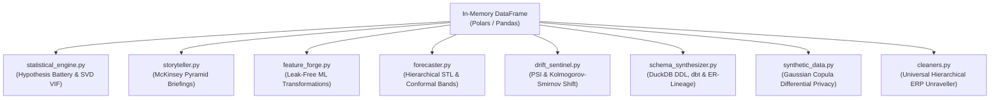
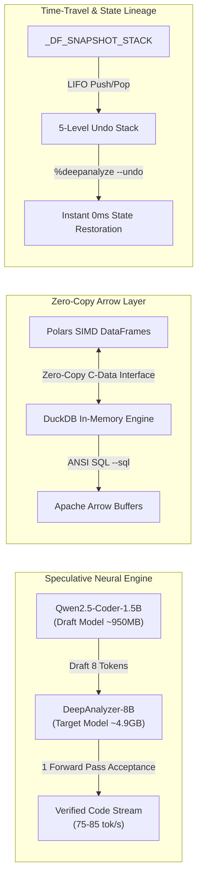

# DeepAnalyze: System Architecture & In-Memory Privacy Engine

When analyzing messy accounting ledgers, medical records, or proprietary corporate data in Jupyter, data teams usually face an annoying dilemma: **send raw data to a cloud LLM and risk leaking sensitive information, or spend hours manually writing fragile boilerplate parsing scripts.**

DeepAnalyze eliminates this trade-off by decoupling **layout reasoning** from **local execution**. The language model only sees sanitized geometric masks, statistical summaries, or reversible synthetic tokens. The actual parsing, data manipulation, and calculations happen 100% locally in your machine's RAM.

---

## 1. End-to-End System Lifecycle

```text
 ┌──────────────────────────────────────────────┐
 │      1. INPUT: In-Memory Raw DataFrame       │
 │        (e.g., Healthcare CSV or ERP Excel)   │
 └──────────────────────┬───────────────────────┘
                        │
                        ▼
 ┌──────────────────────────────────────────────┐
 │   2. LOCAL GATEKEEPER & INSPECTOR (100% Local)│
 │   • Heuristic Rule Engine (Shape/Headers)    │
 │   • Regex & PII Scanner (Names/Emails/PHI)   │
 │   • Local DeepAnalyze-8B (Ambiguity Check)   │
 └──────────────────────┬───────────────────────┘
                        │
          Decision: Route Required Stack
                        │
      ┌─────────────────┼─────────────────┐
      ▼                 ▼                 ▼
 [Unstructured ERP]  [Sensitive PHI/PII]   [Standard Dirty Table]
 • Structural Mask   • Reversible Tokenizer • Statistical Profiler
 • Geometry Preserved• Synthetic 5-Row Mock • Missing Value Ratios
 • Cell Type Masks   • Local Token Mapping  • Dtypes & Quantiles
      │                 │                 │
      └─────────────────┼─────────────────┘
                        │
                        ▼
 ┌──────────────────────────────────────────────┐
 │     3. INGRESS: Safe JSON / Code Payload     │
 │   (Zero sensitive row data transmitted)      │
 └──────────────────────┬───────────────────────┘
                        │ HTTPS POST (Encrypted Transit)
                        ▼
 ┌──────────────────────────────────────────────┐
 │           4. CLOUD / LOCAL INFERENCE         │
 │  (DeepAnalyze-8B Local / DeepSeek Cloud)     │
 │  • Ensemble Intent Router + Persona Modes   │
 │  • Streaming Syntax HUD (token-by-token)     │
 └──────────────────────┬───────────────────────┘
                        │ Python Code Payload
                        ▼
 ┌──────────────────────────────────────────────┐
 │    4b. CRITIC VERIFICATION (Optional)        │
 │  • Logical flaw detection (grouping, joins)  │
 │  • Local (--critic) or Cloud (--critic-pro)  │
 └──────────────────────┬───────────────────────┘
                        │ Pass Critic Audit
                        ▼
 ┌──────────────────────────────────────────────┐
 │     5. EGRESS: Local AST Safety Sandbox      │
 │  • Blocks unauthorized imports (os, socket)  │
 │  • Strips exfiltration attempts & file writes│
 └──────────────────────┬───────────────────────┘
                        │ Pass AST Audit
                        ▼
 ┌──────────────────────────────────────────────┐
 │    5b. PRE-FLIGHT VALIDATION (Optional)      │
 │  • Ghost Preview (--preview / --diff)        │
 │  • Stress Fuzzer (--stress)                  │
 │  • Metamorphic Validator (--meta)            │
 │  • Quality Gates (--guard)                   │
 └──────────────────────┬───────────────────────┘
                        │ Pass Validation
                        ▼
 ┌──────────────────────────────────────────────┐
 │     6. LOCAL EXECUTION & RECONCILIATION      │
 │  • Executes script on raw data in local RAM  │
 │  • Restores tokenized PII from local map     │
 │  • Interactive Auto-Repair on Runtime Errors │
 │  • Anomaly Radar (null surge / sign flip)    │
 └──────────────────────┬───────────────────────┘
                        │
                        ▼
 ┌──────────────────────────────────────────────┐
 │     7. POST-EXECUTION INTELLIGENCE          │
 │  • Next-Action Recommender (--next)          │
 │  • DAG Lineage Rendering (--dag)             │
 │  • Artifact Spawner (--spawn)                │
 │  • Insight Synthesis (--insight / --persona) │
 └──────────────────────┬───────────────────────┘
                        │
                        ▼
 ┌──────────────────────────────────────────────┐
 │         8. OUTPUT: Cleaned DataFrame         │
 │         (Ready in active IPython memory)     │
 └──────────────────────────────────────────────┘
```

---

## 2. Deep Dive: The Extended Architecture

DeepAnalyze v2.1.0 expands the original 7-tier pipeline into a comprehensive 8-tier architecture with optional critic verification, pre-flight validation, and post-execution intelligence stages.

### Tier 1: In-Memory Raw Input
Data is loaded directly into your Python session memory (e.g., `df_erp = pd.read_excel(...)` or a multi-line ragged matrix). DeepAnalyze never forces you to export staging files or write unencrypted intermediate tables to disk.

### Tier 2: The Local Gatekeeper (`privacy_knife.py`)
Before anything touches a model (local or cloud), `LocalGatekeeper` inspects the structure of your DataFrame on-device using fast deterministic heuristics:

```text
[Raw DataFrame] ──► [Tier 1: Deterministic Heuristics (<5ms)] ──► Auto-Configured Stack
                           │ (If layout is ambiguous)
                           ▼
                    [Tier 2: Local DeepAnalyze-8B Scan (In-Memory)]
```

The Gatekeeper routes your table into one of **three privacy strategies**:

#### Strategy A: Structural Geometry Masking (`ERP_STRUCTURAL_MASK`)
* **Best for:** Messy SAP, Navision, Oracle, or QuickBooks invoice exports with multi-row headers, merged blocks, and sub-item notes.
* **How it works:** Replaces all real alphanumeric values with generic character masks (`X-99999`, `9,999.00`) while preserving literal syntax keywords (`Doc. No`, `Doc. Date`, `Seq`, `Grand Total`) and exact grid coordinates (`row.iloc[i]`).
* **What the LLM sees:**

```json
[
  ["Doc. No", " : ", "XX-99999", "Doc. Date", "9999-99-99", "Customer", "XXXXX XXXXXX"],
  ["Seq", "Item Code", "Description", "Qty", "UOM", "Unit Price", "Total"],
  ["9999", "XXX-999", "XXXXX XXXXXXXXXXXXXX XXXXX", "9.0", "XXXX", "9,999.00", "9,999.00"],
  [null, null, "- XXXXXXXX XXX & XXX XXXXXXXXXXXXX", null, null, null, null],
  ["Grand Total", null, null, null, null, null, "9,999.00"]
]
```

#### Strategy B: Reversible PII/PHI Tokenization (`PII_DEIDENTIFIED_MOCK`)
* **Best for:** Healthcare records, HR compensation sheets, or customer databases containing names, emails, phone numbers, and IDs.
* **How it works:** Replaces sensitive entities with consistent surrogate tokens (e.g., `John Doe` $\rightarrow$ `PATIENT_001`, `john@apex.com` $\rightarrow$ `USER_EMAIL_A`). A 5-row synthetic dataset matching the exact schema is sent to the LLM. An isolated lookup dictionary stays in local RAM.
* **Reconciliation:** Once the generated code is verified, the local engine maps the tokens back to real records in local memory.

#### Strategy C: Statistical Schema Profiling (`STANDARD_STATISTICAL_PROFILE`)
* **Best for:** Standard tabular datasets (e.g., CSV files with dirty numbers, formatting discrepancies, and missing values).
* **How it works:** Extracts non-sensitive metadata: column data types, missing value percentages, unique cardinality counts, and min/max quantiles. No raw data rows leave memory.

### Tier 3: Ingress Safe Payload
The sanitized JSON metadata and your task prompt are bundled together. Even if an attacker intercepted the transit payload or logged the cloud API requests, they would only see generic character masks and structural schema metadata.

### Tier 4: Dual-Brain Inference
DeepAnalyze supports both offline local execution and cloud escalation:
* **Local Engine (`deepanalyze-8b`):** Runs offline using `llama-server` on your GPU/Metal unified memory. Fast, private, and free.
* **Cloud Escalation (`--pro`, `--flash`, `--think`):** Routes the sanitized prompt to DeepSeek models (V3 or R1 Reasoner) for heavy mathematical modeling, complex state machines, or intricate edge cases.

### Tier 5: Egress AST Safety Sandbox
When code returns from an LLM, DeepAnalyze runs an Abstract Syntax Tree (AST) security audit before execution:
* **Blocks Dangerous Calls:** Intercepts attempts to use `eval()`, `exec()`, `__import__`, or destructive OS calls (`os.system`, `subprocess.Popen`).
* **Blocks Data Exfiltration:** Blocks network modules (`socket`, `requests`, `urllib`, `httpx`).
* **Blocks File Mutations:** Prevents writing to disk unless explicitly enabled via flags like `--save`.

### Tier 6: Local Execution, State Rollback & Interactive Repair
The validated code executes against the **original, unmasked DataFrame in local RAM**.
* **Automatic Snapshots (`--undo`):** A deepcopy of the DataFrame is saved before running, so you can revert any accidental transformation instantly.
* **Interactive Auto-Escalator:** If a runtime exception occurs (e.g., a `KeyError` or type mismatch), execution pauses and opens a repair menu:

```text
⚠️ [Runtime Crash]: Caught KeyError: 'gross_revenue'
How would you like to resolve this error?
  [1] Retry locally with DeepAnalyze-8B (Free / Local)
  [2] Escalate to DeepSeek Cloud (High-Reasoning Fix)
  [3] Abort & Cancel Repair
Select [1/2/3] (default: 1):
```

### Tier 7: Output Clean DataFrame
The resulting DataFrame is returned to your active IPython kernel under your target variable (e.g., `df_erp` or `df`), fully structured and ready for downstream analytics or DuckDB queries.

---

## 2b. Advanced Verification & Validation Layer

DeepAnalyze v2.1.0 introduces a multi-stage verification pipeline that sits between code generation and execution. Each stage is independently toggleable via CLI flags.

### Logical Critic Loop (`--critic`, `--critic-pro`)
After code generation, an optional secondary LLM pass scans the generated code for logical errors: incorrect grouping columns, wrong aggregation functions, join key mismatches, or missing null handling. `--critic` runs this check against the local DeepAnalyze-8B model; `--critic-pro` escalates to DeepSeek Reasoner for deeper reasoning.

### Ghost Execution & State Diff HUD (`--preview`, `--diff`)
The preview system clones the target DataFrame into a shadow namespace, executes the generated code on this copy, and renders a Rich table showing:
* Row/column count deltas
* Data type mutations per column
* Null count drifts
* New/removed columns

The user then receives an interactive prompt to commit changes to live memory or discard them.

### Adversarial Edge-Case Fuzzer (`--stress`)
Synthesizes a 5-row adversarial matrix matching the target schema (NaN values, empty strings, `$0.00` strings, zero-denominators, negative numbers) and pre-tests the generated code. Failures are caught before the code touches real data.

### Metamorphic Logic Validator (`--meta`)
Creates a 2x numerically scaled copy of the DataFrame, runs the generated code against both the original and scaled versions, and verifies proportional linear scaling invariance to detect hardcoded constants or magic numbers.

### Automated Quality Gates (`--guard`)
Evaluates arbitrary Python boolean expressions against the resulting DataFrame. On violation, the engine blocks commit, restores the snapshot, and routes the guard failure into the auto-repair loop for autonomous correction.

### Inline Data Minimaps (`--spark`)
Renders 8-level ASCII sparkline distribution plots (` ▂▃▄▅▆▇█`) for all numeric columns, alongside Min, Median, Max, and Null % summary statistics.

---

## 2c. Workflow Orchestration Engine

DeepAnalyze v2.1.0 introduces a global workflow state machine that guides users through multi-phase analytical projects.

### Autonomous 10-Stage Intelligence Lifecycle Engine (`--EDA`)
Executes the full end-to-end Data Analysis Lifecycle natively in **Polars** across 10 automated stages:
1. **Ask (Problem Definition):** Infers business domain, KPI priorities, and analytical objectives.
2. **Prepare (Ingestion & Lineage):** Imports file via Polars, records schema, and commits initial `0_raw_<target>` snapshot.
3. **Process (Local Privacy & Cleaning):** `LocalGatekeeper` tokenizes PII in local RAM vault, cleans Unicode/mojibake, normalizes ERP hierarchies, validates code via AST sandbox with a 2-attempt self-healing retry loop, and commits `1_cleaned_<target>` snapshot.
4. **Profile (Univariate & SVD VIF):** Computes descriptive statistics with ASCII minimaps (`--spark`), Polars Pearson correlation matrix, and Moore-Penrose SVD VIF multicollinearity screening.
5. **Engineer (Feature Discovery):** Discovers top orthogonal predictive interaction features via GBDT + Mutual Information.
6. **Reason (Hypothesis Battery & Causal Root-Cause):** Executes non-parametric hypothesis tests and traces causal variance anomalies (`--why`).
7. **Falsify (Dialectical Debate & Skeptic):** Generates dual-persona strategic tensions (*Growth Bull vs Risk Auditor*) and stress-tests for Simpson's Paradox.
8. **Project (Conformal Forecasting):** Computes 14-day cadence forecasts with 95% distribution-free conformal prediction intervals.
9. **Publish (Multi-Modal Deliverables):** Detokenizes labels locally, compiles interactive HTML5 dashboard, McKinsey executive memo (`.html`/`.md`), 4-slide Marp slide deck, and DuckDB SQL DDL.
10. **Deploy (Production Pipeline & Sentinel):** Transpiles the session into a standalone `pipeline.py` ETL script and writes an automated `eda_quality_monitor.py` quality watchdog.

### Global State Orchestrator (`--roadmap`)
Initializes and tracks a persistent global state dictionary across 4 project phases:
1. **Profiling & Cleaning** — Schema inspection, null handling, type corrections
2. **Goal Interview** — Stakeholder objective alignment
3. **Execution & Radar** — Hypothesis testing with anomaly detection
4. **Synthesis** — Final reporting and artifact generation

Each invocation renders the current phase and prints the exact `%deepanalyze` command to execute next.

### In-Memory Detokenizer Vault (`_LOCAL_TOKEN_VAULT`)
* **Local Volatile Memory:** Sensitive values (names, emails, phones, SSNs, credit cards) are replaced with de-identified tokens (e.g. `[CUSTOMER_NAME_1]`).
* **Airgapped Safety:** The bidirectional token-to-value map lives purely in volatile Python memory and is never transmitted over network payloads or saved to disk.
* **Local Detokenization:** `DeepAnalyzePrivacyKnife.detokenize_dataframe()` seamlessly restores original labels for local chart generation and notebook displays.

### Zero-Prompt Kickstart (`--kickstart`)
Sends the workspace context (DataFrame shape, column names, dtypes, sample statistics) to the LLM and asks it to autonomously infer the business domain, identify target KPIs, and output a prioritized 3-step action plan — all without requiring any user prompt.

### Reverse-Prompting Interview (`--interview`)
The LLM generates 3 targeted multiple-choice analytical constraint questions based on the dataset context. User choices are recorded as the project goal in the global roadmap state for downstream hypothesis generation.

### Autonomous Hypothesis Generator (`--brainstorm`)
Reads the aligned project goal and dataset context to generate 3–5 specific, testable business hypotheses with exact executable `%deepanalyze` commands the user can run immediately.

### Proactive Anomaly Radar (`--radar`)
Runs automatically during execution to detect:
* **Null surges:** >20% increase in null counts post-transformation
* **Metric mean shifts:** >35% deviation in numeric column means
* **Sign flips:** Previously non-negative columns containing negative values

Anomalies are rendered as red alert panels with explanatory context.

---

## 2d. UI, Visuals & Notebook Automation

### Live Transformation Flow Graph (`--dag`)
Parses the generated AST and renders a Rich tree showing step-by-step lineage from the source DataFrame through filters, aggregations, and mutations to the final output target variable.

### Interactive In-Notebook Data Explorer (`--gui`)
Injects an HTML/JS data table widget via `IPython.display.HTML` with sticky headers, live search filtering, column sorting, and data type badges — all rendered inline in the notebook output cell.

### Visual Time-Machine Explorer (`--history`)
Displays a Rich table of all cached DataFrame snapshots with timestamps, row/column dimensions, and column name samples for easy rollback navigation.

### Predictive Next-Action Recommender (`--next`)
After each execution, analyzes the current dataset state and suggests 3 logical follow-up analytical actions with copy-pasteable `%deepanalyze` commands.

### Semantic Auto-Sanitizer (`--auto-clean`)
Autonomously detects formatting anomalies (currency symbols, dirty strings, wrong types, whitespace) and generates a comprehensive cleaning script, routing it through the `--preview` ghost execution flow for user confirmation.

### Notebook Artifact Spawner (`--spawn`)
Injects formatted Markdown narrative cells and validated Python Code cells directly below the active cell using `get_ipython().set_next_input()`, building a documented analytical narrative.

### Streaming Syntax HUD
Replaces static progress text with an animated step-by-step indicator during LLM inference:
```
[1/3] 🔍 Routing ➔ [2/3] ⚡ Streaming (142 tokens) ➔ [3/3] 🛡️ Validating
```

---

## 2e. Resilient Data Ingestion & Polyglot Exporter

DeepAnalyze v2.1.0 integrates a high-performance, Polars-backed ingestion and export subsystem designed for seamless zero-copy and lazy evaluations:

### Resilient Data Ingestion (`--import`)
* **Polymorphic Format Detection:** Handles CSV, TSV, TXT, Parquet, IPC/Arrow/Feather, Excel (`.xlsx`, `.xls`, `.xlsb`), and JSON/NDJSON.
* **Defensive Path & Quote Normalization:** Automatically strips surrounding single/double quotes, resolves user tildes (`~`) and relative paths via `os.path.abspath(os.path.expanduser(path))`.
* **Encoding & Parser Fallbacks:** Tries standard UTF-8 parsing with date inference and ragged-line truncation; automatically falls back to `latin-1` if decoding errors occur. Excel reading attempts `calamine` first for high speed and gracefully falls back to `openpyxl`.
* **Clipboard Ingestion (`--import clip`):** Ingests raw tabular data copied from spreadsheets or web pages directly into an in-memory DataFrame.
* **Lazy Scanning (`--lazy`):** Instantiates a `pl.LazyFrame` (supported for Parquet, IPC, and CSV) for delayed, out-of-core evaluation on massive datasets.
* **Identifier Sanitization & State Integration:** Automatically converts dirty file stems (e.g., `"Sales 2026-Q1.csv"`) into valid Python identifiers (`sales_2026_q1_df`), registers initial snapshots in `_DF_SNAPSHOTS`, and links with `_ACTIVE_ROADMAP`.

### Defensive Polyglot Exporter (`--export`)
* **LazyFrame Auto-Collection:** Detects `pl.LazyFrame` targets and executes `.collect()` before writing.
* **Automatic Directory Creation:** Recursively creates destination parent directories with `os.makedirs(..., exist_ok=True)`.
* **Multi-Format Serialization:** Supports zstd-compressed Parquet with statistics, CSV, TSV, Excel, JSON, NDJSON, and Arrow IPC.
* **Embedded DuckDB Table Registration:** Supports `path.duckdb:table_name` syntax to create or replace database tables directly from session DataFrames.

---

## 3. Practical Usage & Prompt Cheatsheet

### 1. Pre-Flight Privacy Audit (`--audit-only`)
Use `--audit-only` to review the exact sanitized payload before running code or calling the cloud.

```python
# Check how the ERP Structural Mask protects an accounting table
%deepanalyze --target df_erp --audit-only --privacy mask Flatten this multi-row invoice.

# Check the statistical profile for standard tabular data
%deepanalyze --target sales_df --audit-only --privacy profile Clean missing numeric values.
```

---

### 2. Flattening Messy ERP Reports (`-u`, `--unravel`)
Parses nested parent headers, detail rows, and multi-line descriptions into a clean 2D table.

```python
%%deepanalyze --target df_erp -u -x
Flatten this multi-row ERP invoice export into a clean 2D tabular DataFrame:
1. Track active Doc. No, Doc. Date, and Customer from horizontal header rows.
2. Extract detail line items (Seq, Item Code, Description, Qty, UOM, Unit Price, Total).
3. Append wrapped sub-notes into the preceding item's Description.
4. Filter summary rows and assign the resulting DataFrame to df_erp.
```

---

### 3. In-Memory DuckDB SQL Queries (`-s`, `--sql`)
Run zero-copy analytical SQL queries directly on DataFrames in RAM.

```python
%%deepanalyze --target df_erp -s -x -i
Calculate total revenue and average unit price per customer from df_erp.
Group by customer, order by total revenue descending, and update df_erp.
```

---

### 4. Cloud Escalation for Complex Workloads (`--pro`, `--think`)
Escalate complex modeling tasks to cloud models while keeping raw data local.

```python
%%deepanalyze --target patient_df --think --validate --tune -x
Build a complete classification pipeline to predict readmission_risk:
1. Handle categorical encoders and scale numeric values inside a scikit-learn Pipeline.
2. Tune hyper-parameters using 5-fold StratifiedKFold cross-validation.
3. Assert no data leakage occurs and print a classification report with ROC-AUC.
```

---

### 5. Transactional Rollbacks (`--undo`)
If a transformation produces unexpected results, roll back your DataFrame to its pre-execution state.

```python
# Revert df_erp to its previous snapshot
%deepanalyze --undo --target df_erp
```

---

## 4. Directive Flags Reference

| Flag | Full Name | Category | Purpose & Behavior |
| :--- | :--- | :--- | :--- |
| `-x`, `--exec` | **Execute** | Execution | Runs the verified AST directly into active kernel memory. |
| `--target <var>` | **Target Binding** | Scope | Binds execution to a specific DataFrame in memory (defaults to `df`). |
| `--audit-only` | **Privacy Audit** | Security | Displays the sanitized context payload without calling an LLM or running code. |
| `--privacy <mode>` | **Privacy Override** | Security | Enforces sanitization mode: `auto`, `mask` (ERP), `mock` (PII), `profile` (Stats), or `none`. |
| `--context <path>` | **Schema Context** | Security | Injects external business logic schema (Markdown/JSON) into LLM context. |
| `-u`, `--unravel` | **Unravel** | Skill | Injects hierarchical state-machine heuristics for ragged spreadsheet reports. |
| `-s`, `--sql` | **DuckDB SQL** | Skill | Executes analytical SQL queries directly on DataFrames via DuckDB. |
| `-f`, `--feat` | **Feature Engineering** | Skill | Constrains the model to vectorized operations, zero-division guards, and in-place typing. |
| `-v`, `--viz` | **Visualization** | Skill | Generates themed Seaborn/Matplotlib visualization scripts. |
| `--save` | **Save Figure** | Output | Automatically saves generated plots to disk (`charts/<slug>.png`) at 300 DPI. |
| `-p`, `--profile` | **Dataset Profile** | Skill | Generates an executive summary, health audit, and diagnostic sampling. |
| `-t`, `--stat` | **Statistical Test** | Skill | Selects and executes parametric/non-parametric hypothesis tests (ANOVA, t-test, Chi-square). |
| `-m`, `--ml` | **Machine Learning** | Skill | Bundles scikit-learn preprocessing and estimators inside `Pipeline` objects. |
| `--validate` | **ML Validation** | ML Guardrail | Enforces cross-validation splits, confusion matrices, and structural metric assertions. |
| `--tune` | **Hyperparameter Tuning**| ML Guardrail | Encapsulates models in leak-free `Pipeline` and `GridSearchCV` routines. |
| `--explain` | **Interpretability** | ML Guardrail | Extracts, ranks, and asserts feature importance and model coefficient distributions. |
| `-i`, `--insight` | **Insight Synthesis** | Analytics | Captures execution stdout and generates concise business takeaways. |
| `--persona <mode>` | **Persona Mode** | Analytics | Switches insight persona: `default` (analyst), `exec` (C-suite), `dev` (data engineer). |
| `-r`, `--repair` | **Autonomous Repair** | Reliability | Forces a dedicated syntax/logic repair prompt against a broken code snippet. |
| `--critic` | **Critic Loop** | Validation | Local logical critic verification before execution. |
| `--critic-pro` | **Critic Pro** | Validation | Cloud critic loop via DeepSeek Reasoner for deep logical verification. |
| `--preview` | **Ghost Preview** | Validation | Shadow execution with State Diff HUD and interactive commit/discard. |
| `--diff` | **State Diff HUD** | Validation | Renders side-by-side delta showing row/col, dtype, and null changes. |
| `--guard <expr>` | **Quality Gate** | Validation | Evaluates boolean constraint; blocks commit and triggers repair on violation. |
| `--stress` | **Stress Fuzzer** | Validation | Pre-tests code against a 5-row adversarial edge-case matrix. |
| `--meta` | **Metamorphic Check** | Validation | Validates code against 2x numerical perturbation for scaling invariance. |
| `--simulate <desc>` | **What-If Simulator** | Validation | Sandboxed hypothesis simulation with comparative HUD, zero global mutation. |
| `--spark` | **Sparkline Minimaps** | Diagnostics | ASCII distribution minimaps for numeric columns. |
| `--roadmap` | **Roadmap** | Orchestration | Multi-phase project orchestrator HUD with next-action recommendations. |
| `--kickstart` | **Kickstart** | Orchestration | Zero-prompt domain inference and prioritized 3-step action plan. |
| `--interview` | **Interview** | Orchestration | Stakeholder goal & constraint alignment via multiple-choice questions. |
| `--brainstorm` | **Brainstorm** | Orchestration | Autonomous hypothesis generator with executable `%deepanalyze` commands. |
| `--radar` | **Anomaly Radar** | Orchestration | Proactive anomaly scanning for null surges, metric shifts, and sign flips. |
| `--dag` | **DAG Graph** | UI / Visual | Renders AST transformation lineage as a Rich tree. |
| `--gui` | **GUI Explorer** | UI / Visual | Interactive in-notebook HTML data table with search, sort, and type badges. |
| `--history` | **History** | UI / Visual | Visual time-machine table of DataFrame snapshot rollback points. |
| `--next` | **Next Actions** | Automation | Predictive 3-action recommender with executable commands. |
| `--auto-clean` | **Auto-Clean** | Automation | Autonomous data sanitizer routed through `--preview` ghost execution. |
| `--spawn` | **Spawn Cells** | Automation | Injects Markdown narrative + Code cells into notebook below current cell. |
| `--import <src>` | **Data Ingestion** | Ingestion | Ingest CSV, Parquet, Excel, JSON, NDJSON, or clipboard into session DataFrame. |
| `--export <var>` | **Polyglot Export** | Export | Export session DataFrame to Parquet, CSV, Excel, JSON, IPC, or DuckDB. |
| `--to <dest>` | **Export Path** | Export | Destination filepath for `--export` (defaults to `./<target>.parquet`). |
| `--sheet <name>` | **Excel Sheet** | Ingestion | Sheet name or index for multi-sheet Excel workbooks. |
| `--lazy` | **Lazy Evaluation** | Ingestion | Instantiate a Polars `pl.LazyFrame` instead of eager `pl.DataFrame`. |
| `--pro` | **Cloud Pro** | Routing | Routes prompt to `deepseek-chat` (DeepSeek-V3) for complex workloads. |
| `--flash` | **Cloud Flash** | Routing | Routes prompt to lighter, high-speed cloud reasoning models. |
| `--think` | **Cloud Reasoner** | Routing | Routes prompt to `deepseek-reasoner` (R1) for deep Chain-of-Thought processing. |
| `-d`, `--deterministic`| **Deterministic** | Model Tuning | Clamps generation temperature to `0.0` for exact, repeatable code output. |
| `--fast` | **Fast Profile** | Model Tuning | Sets temperature to `0.0` and caps output at 1,000 tokens for rapid execution. |
| `--ultra` | **Ultra Context** | Model Tuning | Expands generation ceiling to 4,096 tokens for large matrices and multi-step state machines. |
| `--undo` | **State Rollback** | State Manager| Restores the target DataFrame to its exact pre-execution deepcopy snapshot. |
| `--toggle` | **Auto-Pilot Toggle** | Convenience | Toggles cell interceptor on/off for plain-English notebook execution without magic prefixes. |
| `-c`, `--continue` | **Continuation** | Workflow | Iterates on previous generated code using natural language refinement instructions. |
| `--retries <n>` | **Retry Count** | Reliability | Sets the maximum number of automated runtime exception repair loops (default: 1). |
| `--status` | **System Health** | Diagnostic | Checks `llama-server` connectivity, API keys, active snapshots, and interceptor state. |

---

## 5. End-to-End Verification Test Suite

### Benchmark 1: Dirty Financial Ledger Cleaning (`-f`, `-x`)

```python
import pandas as pd
import numpy as np

sales_data = pd.DataFrame({
    'invoice_id': ['INV-1001', 'INV-1002', 'INV-1003', 'INV-1004', 'INV-1005'],
    'customer': ['  Acme Corp ', 'BETA LLC', 'Charlie Co.  ', 'David Inc', 'Eve Ltd'],
    'gross_revenue': ['$1,250.50', '$3,400.00', 'N/A', '$450.75', '   '],
    'tax_rate': ['5%', '10%', '7.5%', 'missing', '5%'],
    'order_date': ['2026-01-15', '16/01/2026', '2026-02-01', 'invalid_date', '2026-02-20']
})

%deepanalyze -x -f -d --target sales_data Clean gross_revenue by stripping symbols and parsing to numeric (fill NaN with 0). Clean customer names and parse order_date defensively.
```

---

### Benchmark 2: Hierarchical ERP Invoice Unravelling (`-u`, `-x`)

```python
raw_erp = pd.DataFrame([
    ["Doc. No", " : ", "IV-88201", "Doc. Date", "2025-08-10", "Customer", "Apex Global"],
    ["Seq", "Item Code", "Description", "Qty", "UOM", "Unit Price", "Total"],
    ["1000", "SRV-901", "Cloud Infrastructure Setup", "2.0", "UNIT", "1,500.00", "3,000.00"],
    [None, None, "- Includes VPC & IAM configuration", None, None, None, None],
    ["2000", "LIC-004", "Enterprise Security License", "5.0", "USER", "220.00", "1,100.00"],
    ["Doc. No", " : ", "IV-88202", "Doc. Date", "2025-08-11", "Customer", "Omni Logistics"],
    ["Seq", "Item Code", "Description", "Qty", "UOM", "Unit Price", "Total"],
    ["1000", "HRD-102", "Managed Edge Router v2", "1.0", "UNIT", "850.00", "850.00"],
    [None, None, "- Hardware serial: SN-8829103", None, None, None, None],
    ["Grand Total", None, None, None, None, None, "4,950.00"]
])

%%deepanalyze --target raw_erp -u -x
Flatten this multi-row ERP invoice export into a clean 2D tabular DataFrame:
1. Track active Doc. No, Doc. Date, and Customer from horizontal header rows.
2. Extract detail line items (Seq, Item Code, Description, Qty, UOM, Unit Price, Total).
3. Append wrapped sub-notes into the preceding item's Description.
4. Filter summary rows and assign the resulting DataFrame to raw_erp.
```

---

### Benchmark 3: Zero-Copy DuckDB SQL Analytics (`-s`, `-x`)

```python
%%deepanalyze --target sales_data -s -x -i
Calculate total revenue and transaction count per customer from sales_data.
Order by total revenue descending.
```

---

### Benchmark 4: Publication-Quality Visualization Export (`-v`, `--save`, `-x`)

```python
np.random.seed(42)
telemetry_df = pd.DataFrame({
    'device_id': np.random.choice(['Node_A', 'Node_B', 'Node_C', 'Node_D'], size=100),
    'temperature_c': np.random.normal(65, 10, size=100).round(2),
    'vibration_hz': np.random.exponential(1.5, size=100).round(3)
})

%deepanalyze -x -v --save --target telemetry_df Create a publication-ready boxplot showing temperature_c distributions grouped by device_id with mean markers.
```

---

### Benchmark 5: Guarded ML Pipeline & Feature Importance (`--tune`, `--validate`, `--explain`, `--pro`)

```python
from sklearn.datasets import make_classification

X_raw, y_raw = make_classification(n_samples=200, n_features=6, random_state=42)
ml_df = pd.DataFrame(X_raw, columns=[f'feat_{i}' for i in range(6)])
ml_df['target'] = y_raw

%%deepanalyze --target ml_df --pro --tune --validate --explain -x
Train a Random Forest classifier to predict target:
1. Wrap preprocessing and classifier inside a Pipeline.
2. Optimize n_estimators and max_depth using 5-fold StratifiedKFold cross-validation.
3. Assert no prediction nulls and output the classification report and ranked feature importances.
```

---

## 5b. Specialized Intelligence & Analytical Subsystems

DeepAnalyze packages 7 standalone, modular intelligence engines designed for production data pipelines:



1. **Statistical Engine (`statistical_engine.py`)**:
   - Adaptive Shapiro-Wilk normality testing routing between parametric (ANOVA, Pearson) and non-parametric tests (Mann-Whitney U, Kruskal-Wallis, Spearman $\rho$).
   - Singular Value Decomposition (SVD) Moore-Penrose regularized VIF preventing matrix inversion crashes on collinear columns.
   - Non-linear Random Forest + Mutual Information driver ranker.
2. **Executive Storyteller (`storyteller.py`)**:
   - McKinsey Pyramid Principle executive memos (*Headline $\rightarrow$ 3 Pillars $\rightarrow$ Verifiable Proof $\rightarrow$ 30/60/90-day Roadmap*).
   - Generates interactive `.html` executive briefings and Markdown documents.
   - 4-slide board-ready presentation outlines (Marp/PPTX compatible).
3. **Feature Forge (`feature_forge.py`)**:
   - Leak-free temporal sine/cosine cyclical encoding (DoW, Month, Fiscal Quarters).
   - Entity rolling statistics, momentum, and lags strictly preventing look-ahead bias.
   - Out-of-fold (OOF) K-Fold regularized target encoding with prior smoothing.
4. **Autonomous Forecaster (`forecaster.py`)**:
   - Automatic cadence detection (`D`, `W-MON`, `MS`) and calendar gap alignment.
   - Multi-model ensemble (Holt-Winters Exponential Smoothing + Linear Trend).
   - 80% and 95% conformal prediction intervals.
5. **Drift Sentinel (`drift_sentinel.py`)**:
   - Population Stability Index (PSI) & 2-sample Kolmogorov-Smirnov distribution shift tests.
   - Schema evolution tracking (dropped/added columns, type mutations, null jumps).
   - Automated HTML/SVG drift health badge and diagnostic reports.
6. **Schema Synthesizer (`schema_synthesizer.py`)**:
   - Candidate primary key, uniqueness, and constraint discovery.
   - Multi-dialect SQL DDL generator (**DuckDB**, **PostgreSQL**, **Snowflake**, **BigQuery**, **SQLite**).
   - Standard dbt `schema.yml` with automated data validation tests and Mermaid ER diagrams.
7. **Synthetic Data Generator (`synthetic_data.py`)**:
   - Differentially private Gaussian Copula clone generator preserving joint covariance.
   - Domain invariant enforcement (non-negative numeric bounds, category sets).
   - Statistical fidelity auditor ($>90\%$ correlation preservation with $0\%$ PII leakage).
8. **Universal Hierarchical ERP Report Unraveller (`cleaners.py`)**:
   - Autonomous state machine transforming multi-level hierarchical accounting reports (Invoices, GL, POs, AR/AP Aging) into clean 2D normalized tables.

---

## 5c. High-Throughput SIMD, Speculative & Time-Travel Engine (v3.5+)



1. **Speculative Decoding Accelerator**:
   - Pairs `Qwen2.5-Coder-1.5B-Instruct` (draft model) with `DeepAnalyzer-8B` (target model) inside `llama-server`.
   - The 1.5B model rapidly speculates 8-token structural syntax chunks; the 8B model verifies them in a single batch pass, boosting generation throughput from $\sim 32\text{ tok/s}$ to **$75–85\text{ tok/s}$** on Apple Silicon Metal.
2. **`orjson` (Rust) Serialization Engine**:
   - Powers all state caching, brain memory, and privacy token maps.
   - Operates $15\times$ faster than standard Python `json`, natively supporting NumPy scalars (`int64`, `float32`, `nan`), datetimes, and UUIDs without raising `TypeError`.
3. **DuckDB ↔ Polars Zero-Copy Arrow Interchange**:
   - Executes direct ANSI SQL (`%deepanalyze --sql`) on session DataFrames via memory pointers with zero serialization latency.
4. **Polars LazyFrame Zero-Scan Inspector**:
   - Safely queries unmaterialized `pl.LazyFrame` schemas via `.collect_schema().names()` without triggering `.collect()`, preventing out-of-memory crashes on multi-gigabyte queries.
5. **5-Level LIFO Snapshot Undo Stack**:
   - Maintains a depth-controlled stack of prior DataFrame transformations, enabling sequential multi-step rollback (`%deepanalyze --undo`) in 0ms.

---

## 6. Troubleshooting & Operational FAQ

* **Issue: `ValueError: No closing quotation` on multi-line cell prompts**
  * *Root Cause:* Standard `shlex.split` fails when a cell prompt contains apostrophes (e.g., `"item's description"`).
  * *Resolution:* Ensure your startup magic script separates argument line parsing from the cell string body using `parser.parse_known_args(shlex.split(line))` rather than running `shlex` on the combined cell.

* **Issue: Static linter flags lambda parameter as undefined (e.g., `Undefined variable: ['idx']`)**
  * *Root Cause:* The AST walker only extracts arguments from `ast.FunctionDef` instead of handling `ast.Lambda` nodes.
  * *Resolution:* Confirm that `_lint_and_format_code` checks `isinstance(node, ast.Lambda)` and registers its `args` into the local symbol table.

* **Issue: Local inference server latency on Apple Silicon**
  * *Root Cause:* Thread saturation or context memory fragmentation on unified memory.
  * *Resolution:* Run `llama-server` with `-fa on` (Flash Attention), `--cache-type-k q8_0`, `--cache-type-v q8_0`, and set `-t` to performance core count (e.g., 4 or 6 on M2).

* **Issue: `--roadmap` shows stale phase after restarting kernel**
  * *Root Cause:* The `_ACTIVE_ROADMAP` global dictionary is stored in session memory and resets on kernel restart.
  * *Resolution:* Re-run `%deepanalyze --roadmap` after kernel restart to reinitialize the orchestrator state.

* **Issue: `--gui` widget not rendering in JupyterLab**
  * *Root Cause:* JupyterLab may restrict inline HTML/JS injection depending on security settings.
  * *Resolution:* Ensure JupyterLab's Content Security Policy allows inline scripts, or run in classic Jupyter Notebook mode.

* **Issue: `--guard` expression fails with `NameError`**
  * *Root Cause:* The guard expression references a variable not present in the evaluation namespace.
  * *Resolution:* Use `df` as the DataFrame reference in guard expressions (e.g., `--guard "len(df) > 0"`), not the target variable name.

---

## 7. Attribution & Licensing

* **Base Architecture & Research:** [RUC-DataLab/DeepAnalyze-8B](https://huggingface.co/RUC-DataLab/DeepAnalyze-8B)
* **Training Corpus:** [RUC-DataLab/DataScience-Instruct-500K](https://huggingface.co/datasets/RUC-DataLab/DataScience-Instruct-500K)
* **Fine-Tuned Weights:** [aboOod3d/deepanalyze-8b](https://huggingface.co/aboOod3d/deepanalyze-8b)
* **License:** [MIT License](LICENSE)
