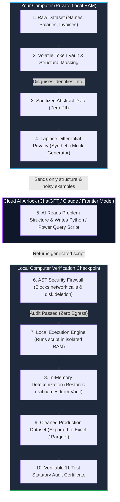

# DeepAnalyze Privacy & Zero-Knowledge Architecture Guide

> **Welcome!** If you've ever wondered how modern enterprise applications can use powerful Cloud Artificial Intelligence (like GPT-4o or Claude 3.5) to clean and fix messy spreadsheets **without ever showing real people's names, passwords, hospital records, or bank balances to the AI**, this document explains exactly how DeepAnalyze does it.

---

## 1. The Big Problem: The "Homework Helper" Dilemma

Imagine you have a private diary full of personal secrets, but you also have a super-smart robot tutor on the internet that can solve complex math puzzles and organize messy notebooks. 

* **If you send your real diary pages over the internet to the robot**, anyone intercepting the internet traffic—or the company running the robot—could read your private secrets. By corporate and national privacy laws (like **Saudi PDPL**, **EU GDPR**, or **US HIPAA**), doing this with company or hospital records is strictly illegal.
* **If you don't send anything**, you have to clean and fix hundreds of thousands of messy, broken spreadsheet rows completely by hand.

### How DeepAnalyze Solves This: The Zero-Knowledge Airlock
DeepAnalyze acts as a **smart privacy bodyguard** living right inside your computer's temporary memory (RAM). Before anything is sent to the AI, DeepAnalyze strips away all personal identities, disguises confidential numbers with mathematical "fog", and only shows the AI the *shape* and *structure* of the problem. 

The AI writes the code to fix the spreadsheet based on the disguise. Then, your computer takes that code, inspects it for safety, runs it locally behind closed doors, and restores all the original identities. **Zero real production records ever leave your laptop.**

---

## 2. The Complete Zero-Knowledge Data Lifecycle

Here is how data moves through DeepAnalyze from raw input to clean output:

---

## 3. The 6 Privacy & Encryption Techniques (Explained Simply)

### 1. Volatile In-Memory Token Vault (`vault.py`)
* **High School Metaphor:** The "Secret Agent Code Names"
* **How it works:** 
  Imagine you are throwing a secret party. At the door, the host hands every guest a temporary code name badge: *Sarah Jenkins* becomes `Agent Falcon (<NAME_1>)`, and her bank account becomes `Account 007 (<IBAN_1>)`. 
  
  The host writes down who is who on a private notepad kept strictly in their pocket. If a stranger peeks inside the room, they only hear `Agent Falcon` and have no idea who Sarah is. When Sarah is ready to go home, the host checks the notepad, hands her real ID card back, and immediately shreds the notepad.
* **In DeepAnalyze:** 
  The mapping table lives **only in volatile RAM**. It is never written to your hard disk and is instantly destroyed as soon as the session closes. When the AI finishes cleaning the data, DeepAnalyze automatically detokenizes the file, restoring every real name and character with 100.00% precision.

---

### 2. Structural Geometric ERP Masking (`sentinel.py`)
* **High School Metaphor:** The "Store Mannequin"
* **How it works:** 
  If a fashion designer wants to teach someone how to sew a jacket, they don't need a real living person standing there for hours. They use a plastic mannequin that has the exact height, shoulders, and measurements of a human body, but isn't a real person.
* **In DeepAnalyze:**
  Messy ERP spreadsheets (like Oracle, SAP, or QuickBooks invoice listings) have complex visual shapes: header rows, date stamps, subtotal blocks, and nested line items. DeepAnalyze creates a "mannequin" version of the spreadsheet: it preserves the exact data types, formatting regexes (`INV-#####`), and visual layout, but replaces the real confidential values with structural tokens. The AI learns how to untangle the spreadsheet without seeing your company's actual transactions.

---

### 3. k-Anonymity & l-Diversity (`kanonymity.py`)
* **High School Metaphor:** "Blending Into the Crowd"
* **How it works:**
  * **$k$-Anonymity:** Imagine you are wearing a bright neon green dinosaur suit in the school cafeteria. Even if you cover your face, anyone looking at you can say, *"There's only one person wearing that suit—it must be Alex!"* ($k = 1$, easy to identify). But if a school club organizes an event where **at least 5 students** in every classroom must wear that exact same dinosaur suit, no one can pinpoint Alex ($k \ge 5$).
  * **$l$-Diversity:** Even if 5 students look identical, if every single one of them has detention for the exact same reason, people can guess your secret. $l$-Diversity makes sure that inside each crowd of 5, there is a diverse mix of attributes ($l \ge 2$), so no one can guess your private status.
* **In DeepAnalyze:**
  DeepAnalyze scans columns that could accidentally reveal someone's identity when combined (like Age, City, and Job Title). It automatically groups exact values into broader brackets (e.g., changing exact age `23` into the bracket `[20-29]`), guaranteeing that no single customer can be singled out from the crowd.

---

### 4. Laplace Differential Privacy (`sentinel.py`)
* **High School Metaphor:** "The Class Secret Survey with Coin Flips"
* **How it works:**
  Suppose a teacher wants to find out what percentage of students have ever failed a test, but students are too embarrassed to answer truthfully. The teacher tells everyone:
  1. Flip a coin secretly.
  2. If heads, answer honestly.
  3. If tails, flip again: heads means say "Yes", tails means say "No".
  
  Because of the coin flips, if a specific student says "Yes", nobody knows if they actually failed or just flipped tails! But mathematically, the teacher can subtract the coin toss probability and calculate the *exact true class percentage*.
* **In DeepAnalyze:**
  When generating synthetic sample numbers to show the AI how formulas should look, DeepAnalyze injects a calibrated statistical "smoke screen" using the **Laplace Distribution** ($\epsilon = 1.0$). The synthetic rows mimic the realistic spread and average of your revenue, prices, or patient metrics, but **not a single real number is an exact copy of any real customer's balance**.

---

### 5. AST Security Firewall & Local RAM Airlock (`firewall.py`)
* **High School Metaphor:** The "Security Guard with a Metal Detector"
* **How it works:**
  When a guest arrives at the school building, a security guard scans their backpack before letting them inside. If the guard finds scissors, fireworks, or unauthorized tools, they confiscate them immediately.
* **In DeepAnalyze:**
  Whenever cloud AI or local models write Python code to transform your spreadsheet, DeepAnalyze **never runs the code blindly**. Before a single line of code executes, our **Abstract Syntax Tree (AST) Firewall** inspects the code structure line-by-line:
  * ❌ Blocks any code attempting to access the internet (`requests`, `urllib`, `socket`, `http`).
  * ❌ Blocks any code attempting to delete or overwrite hard drive files (`os.remove`, `shutil.rmtree`).
  * ❌ Blocks terminal execution attacks (`subprocess`, `eval`, `exec`).
  * ✅ Allows pure, clean data transformation in RAM (`pandas`, `numpy`, `polars`).
  
  **Result:** Guaranteed **0 outbound network calls** during execution.

---

### 6. The 11-Test Statutory Privacy Benchmark Suite (`benchmarks.py`)
* **High School Metaphor:** The "Strict Final Exam & Report Card"
* **How it works:**
  Before a student is allowed to graduate, they must take a rigorous final exam testing every subject.
* **In DeepAnalyze:**
  Before any prompt or payload is allowed to be copied or used, DeepAnalyze runs an automated battery of **11 mathematical stress tests**:

| Test ID | Test Name | What It Tests For | Real-World Passing Target |
| :--- | :--- | :--- | :--- |
| **T1.1** | **Canary String Exfiltration** | Plants hidden fake secret tokens; verifies none leaked into the prompt. | **0.00% leaks (Exact 0)** |
| **T1.2** | **Plaintext Direct PII Scan** | Checks for real Saudi National IDs, SSNs, credit cards, emails, or phone numbers. | **0 matches found** |
| **T1.3** | **Singling-Out Risk ($k$-Anonymity)** | Confirms every person belongs to an equivalence class of peers. | **$k \ge 5$** |
| **T1.4** | **Attribute Homogeneity ($l$-Diversity)** | Confirms sensitive attributes within each group are sufficiently varied. | **$l \ge 2$ distinct values** |
| **T2.5** | **Distribution Skew ($t$-Closeness)** | Ensures grouped data doesn't skew drastically away from natural distributions. | **Wasserstein $D[P, Q] \le 0.15$** |
| **T2.6** | **Empirical Linkability (Anonymeter)** | Simulates a hacker trying to cross-reference the data with public voters lists. | **Linkability risk $< 0.05$ (CNIL standard)** |
| **T2.7** | **Nearest-Neighbor Distance (NNDR)** | Verifies synthetic rows aren't memorized clones of real rows (ISO 27559). | **NNDR $\ge 0.25$** |
| **T2.8** | **Membership Inference Attack (MIA)** | Verifies an attacker cannot guess whether a specific person was in the dataset. | **$\text{AUC} \le 0.55$ (Random chance)** |
| **T2.9** | **Normalized Mutual Information (NMI)** | Ensures non-sensitive columns cannot be used as secret proxies for sensitive data. | **$\text{NMI} < 0.05$** |
| **T2.10** | **AST Security Sandbox Audit** | Verifies 100% of network exfiltration and backdoor attempts are blocked. | **100% egress block rate** |
| **T2.11** | **Round-Trip Lineage Reconciliation** | Verifies every single row and token is restored with 100% mathematical fidelity. | **100.00% character fidelity (BCBS 239)** |

---

## 4. Statutory Regulations We Comply With

DeepAnalyze automatically tunes its privacy policies depending on where your company operates:

1. **Saudi Arabia (PDPL):** Enforces National ID masking (`10-digit civil IDs`), Arabic name pseudonymization, and prevents cross-border cloud transmission of citizen data.
2. **European Union (GDPR):** Enforces Article 4(1) Pseudonymization, Article 29 Working Party Singling-Out defenses, and Right to Erasure in volatile RAM.
3. **United States (HIPAA):** Enforces the 18 Safe Harbor direct identifiers and expert statistical determination standards for patient health information.
4. **Payment Card Industry (PCI-DSS v4.0):** Automatically masks Primary Account Numbers (PAN), CVVs, and magnetic stripe tracks.
5. **United Arab Emirates (DPL) & Singapore (PDPA):** Restricts cross-border data flows and mandates verifiable lineage logs.

---

## 5. Quick Comparison: Without vs. With DeepAnalyze

| Feature | Standard Cloud AI Usage (Dangerous) | With DeepAnalyze Zero-Knowledge Airlock |
| :--- | :--- | :--- |
| **Where does raw data go?** | Sent across the public internet to third-party AI cloud servers. | **Never leaves your computer's local RAM.** |
| **Who sees customer names?** | The AI company, server admins, and potentially hackers. | **Nobody.** Only temporary tokens like `<NAME_1>` are seen. |
| **Are financial totals real?** | Real balances are transmitted and stored in AI chat logs. | **Fuzzed with Differential Privacy ($\epsilon = 1.0$)**; real numbers stay home. |
| **Can AI code harm your PC?** | Malicious or buggy code can delete files or leak data. | **Blocked by AST Security Firewall** (0 network calls allowed). |
| **Compliance Certification?** | None. Subject to regulatory fines and audit failures. | **Generates formal 11-Test Compliance Audit Certificate (`compliance_audit.md`).** |

---
*Document produced for DeepAnalyze Enterprise Privacy & Statutory Compliance.*
